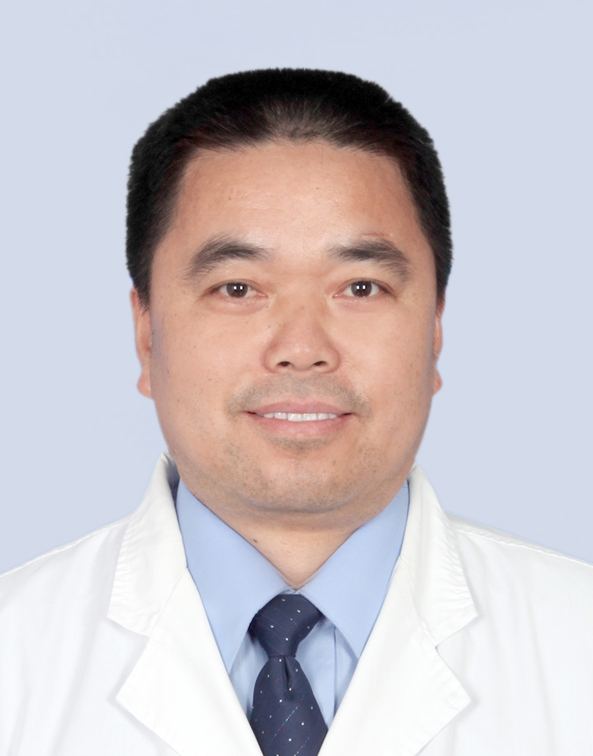

# 周传新

## 基础信息

| 字段 | 内容 |
|---|---|
| 姓名 | 周传新 |
| 医院 | 中山大学附属第五医院 |
| 科室 | 儿科 |
| 职称/身份 | 主任医师，硕士生导师。 |
| 重点优先级 | 高 |
| 来源链接 | https://www.sysu5.cn/medical-service/department-expert/doctor/10018 |
| 采集日期 | 2026-08-08 |

## 简介/擅长

周传新医生来自中山大学附属第五医院儿科，官网公开资料显示其诊疗线索与疑难重症相关。
官网擅长线索：擅长：儿科呼吸系统疾病、儿科疑难病及新生儿科疾病的诊治。 1984年毕业于华中科技大学同济医学院儿科系，2005年中山大学临床研究生班毕业，曾在北京大学第三附属医院进修学习从事儿科专业工作36年，擅长儿科呼吸系统疾病、新生儿疾病的诊治，尤其对儿童喘息性疾病、疑难重症疾病诊治具有丰富的临床经验，现任中国医师协会新生儿科医师分会医学伦理专委会副主委、中国妇幼微创学会呼吸学组委员； 中国中西医结合学会委员，中国海峡两岸卫生交流协会新生儿学专业委员会委员及新生儿诊断学组副组长;

## 可包装亮点

- 主任医师，硕士生导师。
- 擅长：儿科呼吸系统疾病、儿科疑难病及新生儿科疾病的诊治。

## 重点疾病/人群标签

- 慢性病：
- 肿瘤：
- 生殖疾病：
- 免疫/风湿：
- 术后恢复/康复：
- 疑难重症：疑难、重症

## 证据摘录

> 以下只保留官网公开信息中的短句或关键字段，不复制大段原文。

- 官网身份字段：主任医师，硕士生导师。
- 官网擅长线索：擅长：儿科呼吸系统疾病、儿科疑难病及新生儿科疾病的诊治。 1984年毕业于华中科技大学同济医学院儿科系，2005年中山大学临床研究生班毕业，曾在北京大学第三附属医院进修学习从事儿科专业工作36年，擅长儿科呼吸系统疾病、新生儿疾病的诊治，尤其对儿童喘息性疾病、疑难重症疾病诊治具有丰富的临床经验，现任中国医师协会新生儿科…
- 官网经历线索：主任医师，硕士生导师。 擅长：儿科呼吸系统疾病、儿科疑难病及新生儿科疾病的诊治。
- 来源链接：https://www.sysu5.cn/medical-service/department-expert/doctor/10018

## BD 画像摘要

周传新医生可作为疑难重症方向的医生画像候选。后续 BD 包装应围绕官网已展示的科室、职称、擅长和经历线索展开，保持待人工复核状态，不添加疗效承诺。

## 合规边界

- 本条画像仅基于医院官网公开医生详情页整理。
- 未采集私人联系方式、患者案例、非公开排班或第三方评价。
- 所有亮点均需保留来源链接，不得改写为治疗效果承诺。
