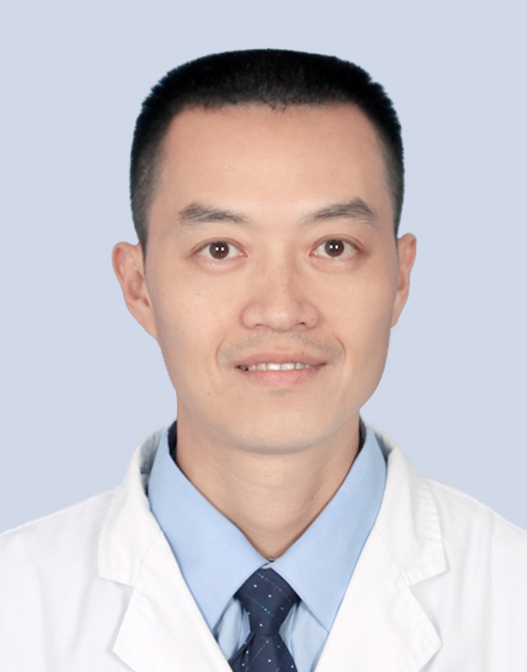

# 唐宇星

## 基础信息

| 字段 | 内容 |
|---|---|
| 姓名 | 唐宇星 |
| 医院 | 中山大学附属第五医院 |
| 科室 | 创伤与关节外科 |
| 职称/身份 | 主治医师，医学硕士。 |
| 重点优先级 | 中 |
| 来源链接 | https://www.sysu5.cn/medical-service/department-expert/doctor/8116 |
| 采集日期 | 2026-08-08 |

## 简介/擅长

唐宇星医生来自中山大学附属第五医院创伤与关节外科。
官网擅长线索：从事骨外科专业工作20余年，擅长四肢骨关节疾病的诊治，尤其对四肢创伤性（骨折、软组织损伤、周围神经损伤、手外伤等）疾病诊治具有丰富的临床经验，现任广东省医学会骨科分会显微外科学会委员。

## 可包装亮点

- 本科毕业于广州中医药大学，获中山大学硕士学位，曾在南方医科大学附属南方医院、中山大学附属第三医院进修学习。
- 从事骨外科专业工作20余年，擅长四肢骨关节疾病的诊治，尤其对四肢创伤性（骨折、软组织损伤、周围神经损伤、手外伤等）疾病诊治具有丰富的临床经验，现任广东省医学会骨科分会显微外科学会委员。

## 重点疾病/人群标签

- 慢性病：
- 肿瘤：
- 生殖疾病：
- 免疫/风湿：
- 术后恢复/康复：
- 疑难重症：

## 证据摘录

> 以下只保留官网公开信息中的短句或关键字段，不复制大段原文。

- 官网身份字段：主治医师，医学硕士。
- 官网擅长线索：从事骨外科专业工作20余年，擅长四肢骨关节疾病的诊治，尤其对四肢创伤性（骨折、软组织损伤、周围神经损伤、手外伤等）疾病诊治具有丰富的临床经验，现任广东省医学会骨科分会显微外科学会委员。
- 官网经历线索：本科毕业于广州中医药大学，获中山大学硕士学位，曾在南方医科大学附属南方医院、中山大学附属第三医院进修学习。 从事骨外科专业工作20余年，擅长四肢骨关节疾病的诊治，尤其对四肢创伤性（骨折、软组织损伤、周围神经损伤、手外伤等）疾病诊治具有丰富的临床经验，现任广东省医学会骨科分会显微外科学会委员。
- 来源链接：https://www.sysu5.cn/medical-service/department-expert/doctor/8116

## BD 画像摘要

唐宇星医生可作为创伤与关节外科基础医生数据入库。当前官网资料暂未显示与本阶段重点疾病方向的强关联，建议先保留基础画像，后续按官方资料补充复核。

## 合规边界

- 本条画像仅基于医院官网公开医生详情页整理。
- 未采集私人联系方式、患者案例、非公开排班或第三方评价。
- 所有亮点均需保留来源链接，不得改写为治疗效果承诺。
