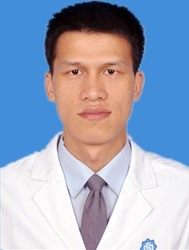

# 姚季金

## 基础信息

| 字段 | 内容 |
|---|---|
| 姓名 | 姚季金 |
| 医院 | 中山大学附属第五医院 |
| 科室 | 鼻咽癌防治中心 |
| 职称/身份 | 副主任医师，医学博士，硕士生导师 |
| 重点优先级 | 高 |
| 来源链接 | https://www.sysu5.cn/medical-service/department-expert/doctor/10888 |
| 采集日期 | 2026-08-08 |

## 简介/擅长

姚季金医生来自中山大学附属第五医院鼻咽癌防治中心，官网公开资料显示其诊疗线索与肿瘤相关。
官网擅长线索：长期从事鼻咽癌放化疗及综合治疗，入选医院高层次人才，担任中国医学教育协会肿瘤放疗专业委员会委员、珠海市抗癌协会鼻咽癌专委会常委&秘书、珠海市抗癌协会肿瘤放射治疗专委会常务等。

## 可包装亮点

- 副主任医师，医学博士，硕士生导师 副主任医师，医学博士，硕士生导师 长期从事鼻咽癌放化疗及综合治疗，入选医院高层次人才，担任中国医学教育协会肿瘤放疗专业委员会委员、珠海市抗癌协会鼻咽癌专委会常委&秘书、珠海市抗癌协会肿瘤放射治疗专委会常务…
- 以第一负责人主持包括国家自然科学基金（2项），省企联合面上项目、珠海市科技等3项临床转化研究课题；

## 重点疾病/人群标签

- 慢性病：
- 肿瘤：肿瘤、癌、瘤、放疗、化疗、鼻咽癌
- 生殖疾病：
- 免疫/风湿：
- 术后恢复/康复：
- 疑难重症：

## 证据摘录

> 以下只保留官网公开信息中的短句或关键字段，不复制大段原文。

- 官网身份字段：副主任医师，医学博士，硕士生导师
- 官网擅长线索：长期从事鼻咽癌放化疗及综合治疗，入选医院高层次人才，担任中国医学教育协会肿瘤放疗专业委员会委员、珠海市抗癌协会鼻咽癌专委会常委&秘书、珠海市抗癌协会肿瘤放射治疗专委会常务等。
- 官网经历线索：副主任医师，医学博士，硕士生导师 副主任医师，医学博士，硕士生导师 长期从事鼻咽癌放化疗及综合治疗，入选医院高层次人才，担任中国医学教育协会肿瘤放疗专业委员会委员、珠海市抗癌协会鼻咽癌专委会常委&秘书、珠海市抗癌协会肿瘤放射治疗专委会常务等。 以第一负责人主持包括国家自然科学基金（2项），省企联合面上项目、珠海市科技…
- 来源链接：https://www.sysu5.cn/medical-service/department-expert/doctor/10888

## BD 画像摘要

姚季金医生可作为肿瘤方向的医生画像候选。后续 BD 包装应围绕官网已展示的科室、职称、擅长和经历线索展开，保持待人工复核状态，不添加疗效承诺。

## 合规边界

- 本条画像仅基于医院官网公开医生详情页整理。
- 未采集私人联系方式、患者案例、非公开排班或第三方评价。
- 所有亮点均需保留来源链接，不得改写为治疗效果承诺。
