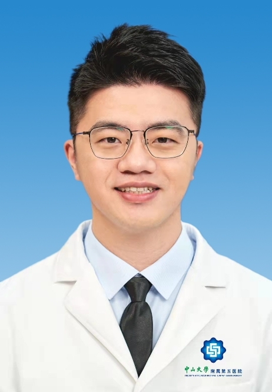

# 廖振鹏

## 基础信息

| 字段 | 内容 |
|---|---|
| 姓名 | 廖振鹏 |
| 医院 | 中山大学附属第五医院 |
| 科室 | 耳鼻咽喉&头颈外科 |
| 职称/身份 | 副主任医师，医学硕士。 |
| 重点优先级 | 高 |
| 来源链接 | https://www.sysu5.cn/medical-service/department-expert/doctor/10717 |
| 采集日期 | 2026-08-08 |

## 简介/擅长

廖振鹏医生来自中山大学附属第五医院耳鼻咽喉&头颈外科，官网公开资料显示其诊疗线索与慢性病、肿瘤、术后恢复/康复相关。
官网擅长线索：2013年从事耳鼻咽喉头颈外科工作至今，擅长各种鼻科、耳科疾病和小儿耳鼻咽喉科常见疾病诊治，尤其擅长过敏性疾病诊治、内镜微创外科及耳鼻咽喉科术后快速康复治疗。 擅长内镜下手术治疗各种慢性中耳炎、中耳胆脂瘤等耳专科疾病，慢性鼻窦炎、鼻中隔偏曲、过敏性鼻炎等鼻专科疾病，同时对儿童鼾症、梅尼埃病、耳石症、突发性耳聋、鼻咽癌放化疗后并发症、慢性咽喉炎等疾病的诊治也具有丰富的临床经验。

## 可包装亮点

- 副主任医师，医学硕士。
- 现任广东省医学会、广东省医师协会耳鼻喉科分会青年委员。
- 主持及参与多项国家级、省级及市级科研课题，发表多篇高水平论文，获得多项专利发明。

## 重点疾病/人群标签

- 慢性病：慢性
- 肿瘤：癌、瘤、化疗、鼻咽癌
- 生殖疾病：
- 免疫/风湿：
- 术后恢复/康复：术后、康复
- 疑难重症：

## 证据摘录

> 以下只保留官网公开信息中的短句或关键字段，不复制大段原文。

- 官网身份字段：副主任医师，医学硕士。
- 官网擅长线索：2013年从事耳鼻咽喉头颈外科工作至今，擅长各种鼻科、耳科疾病和小儿耳鼻咽喉科常见疾病诊治，尤其擅长过敏性疾病诊治、内镜微创外科及耳鼻咽喉科术后快速康复治疗。 擅长内镜下手术治疗各种慢性中耳炎、中耳胆脂瘤等耳专科疾病，慢性鼻窦炎、鼻中隔偏曲、过敏性鼻炎等鼻专科疾病，同时对儿童鼾症、梅尼埃病、耳石症、突发性耳聋、鼻咽癌…
- 官网经历线索：副主任医师，医学硕士。 现任广东省医学会、广东省医师协会耳鼻喉科分会青年委员。 主持及参与多项国家级、省级及市级科研课题，发表多篇高水平论文，获得多项专利发明。
- 来源链接：https://www.sysu5.cn/medical-service/department-expert/doctor/10717

## BD 画像摘要

廖振鹏医生可作为慢性病、肿瘤、术后恢复/康复方向的医生画像候选。后续 BD 包装应围绕官网已展示的科室、职称、擅长和经历线索展开，保持待人工复核状态，不添加疗效承诺。

## 合规边界

- 本条画像仅基于医院官网公开医生详情页整理。
- 未采集私人联系方式、患者案例、非公开排班或第三方评价。
- 所有亮点均需保留来源链接，不得改写为治疗效果承诺。
