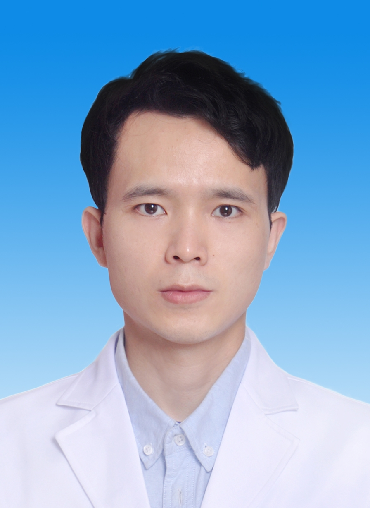

# 张玉龙

## 基础信息

| 字段 | 内容 |
|---|---|
| 姓名 | 张玉龙 |
| 医院 | 中山大学附属第五医院 |
| 科室 | 中医科 |
| 职称/身份 | 医师，医学博士，博士后。 |
| 重点优先级 | 高 |
| 来源链接 | https://www.sysu5.cn/medical-service/department-expert/doctor/10710 |
| 采集日期 | 2026-08-08 |

## 简介/擅长

张玉龙医生来自中山大学附属第五医院中医科，官网公开资料显示其诊疗线索与肿瘤相关。
官网擅长线索：临床擅长中医药调治：（1）呼吸系统（感冒、鼻炎/鼻窦炎、咽炎、支气管炎、肺炎、慢阻肺、哮喘、肺结节等）；

## 可包装亮点

## 重点疾病/人群标签

- 慢性病：
- 肿瘤：肿瘤、癌、瘤、鼻咽癌、肺癌、肝癌、肠癌、乳腺癌
- 生殖疾病：
- 免疫/风湿：
- 术后恢复/康复：
- 疑难重症：

## 证据摘录

> 以下只保留官网公开信息中的短句或关键字段，不复制大段原文。

- 官网身份字段：医师，医学博士，博士后。
- 官网擅长线索：临床擅长中医药调治：（1）呼吸系统（感冒、鼻炎/鼻窦炎、咽炎、支气管炎、肺炎、慢阻肺、哮喘、肺结节等）；
- 来源链接：https://www.sysu5.cn/medical-service/department-expert/doctor/10710

## BD 画像摘要

张玉龙医生可作为肿瘤方向的医生画像候选。后续 BD 包装应围绕官网已展示的科室、职称、擅长和经历线索展开，保持待人工复核状态，不添加疗效承诺。

## 合规边界

- 本条画像仅基于医院官网公开医生详情页整理。
- 未采集私人联系方式、患者案例、非公开排班或第三方评价。
- 所有亮点均需保留来源链接，不得改写为治疗效果承诺。
