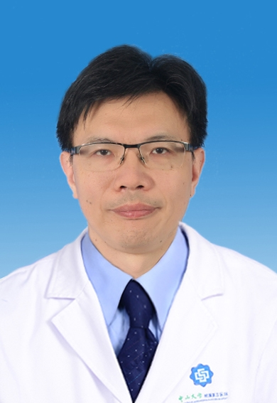

# 张红雨

## 基础信息

| 字段 | 内容 |
|---|---|
| 姓名 | 张红雨 |
| 医院 | 中山大学附属第五医院 |
| 科室 | 腹盆部肿瘤内科 |
| 职称/身份 | 肿瘤中心主任，腹盆部肿瘤科主任，主任医师，医学博士，硕士生导师。 |
| 重点优先级 | 高 |
| 来源链接 | https://www.sysu5.cn/medical-service/department-expert/doctor/10300 |
| 采集日期 | 2026-08-08 |

## 简介/擅长

张红雨医生来自中山大学附属第五医院腹盆部肿瘤内科，官网公开资料显示其诊疗线索与肿瘤、生殖疾病、免疫/风湿/感染、术后恢复/康复、疑难重症相关。
官网擅长线索：从事肿瘤内科诊治工作30余年，擅长各种肿瘤的诊断及内科综合治疗，尤其擅长淋巴瘤、胃肠癌、肝胆肿瘤、泌尿生殖肿瘤及妇瘤的化疗。 熟练掌握并应用肿瘤的靶向治疗及免疫治疗。 主持和参与多项国家新药临床研究，主编或参编《恶性淋巴瘤》、《恶性肿瘤靶向治疗学》等多本专著，培养研究生多人，现任中国临床肿瘤学会（CSCO）罕见肿瘤专业委员会常委； 广东省抗癌协会化疗/淋巴瘤专业委员会/癌痛与姑息治疗专业委员会常委。

## 可包装亮点

- 肿瘤中心主任，腹盆部肿瘤科主任，主任医师，医学博士，硕士生导师。
- 曾参与及承担多项国家级及省市课题，发表相关论著多篇。
- 主持和参与多项国家新药临床研究，主编或参编《恶性淋巴瘤》、《恶性肿瘤靶向治疗学》等多本专著，培养研究生多人，现任中国临床肿瘤学会（CSCO）罕见肿瘤专业委员会常委；

## 重点疾病/人群标签

- 慢性病：
- 肿瘤：肿瘤、癌、瘤、淋巴瘤、化疗、靶向、肠癌
- 生殖疾病：生殖
- 免疫/风湿：免疫
- 术后恢复/康复：姑息
- 疑难重症：罕见

## 证据摘录

> 以下只保留官网公开信息中的短句或关键字段，不复制大段原文。

- 官网身份字段：肿瘤中心主任，腹盆部肿瘤科主任，主任医师，医学博士，硕士生导师。
- 官网擅长线索：从事肿瘤内科诊治工作30余年，擅长各种肿瘤的诊断及内科综合治疗，尤其擅长淋巴瘤、胃肠癌、肝胆肿瘤、泌尿生殖肿瘤及妇瘤的化疗。 熟练掌握并应用肿瘤的靶向治疗及免疫治疗。 主持和参与多项国家新药临床研究，主编或参编《恶性淋巴瘤》、《恶性肿瘤靶向治疗学》等多本专著，培养研究生多人，现任中国临床肿瘤学会（CSCO）罕见肿瘤专…
- 官网经历线索：肿瘤中心主任，腹盆部肿瘤科主任，主任医师，医学博士，硕士生导师。 曾参与及承担多项国家级及省市课题，发表相关论著多篇。 主持和参与多项国家新药临床研究，主编或参编《恶性淋巴瘤》、《恶性肿瘤靶向治疗学》等多本专著，培养研究生多人，现任中国临床肿瘤学会（CSCO）罕见肿瘤专业委员会常委；
- 来源链接：https://www.sysu5.cn/medical-service/department-expert/doctor/10300

## BD 画像摘要

张红雨医生可作为肿瘤、生殖疾病、免疫/风湿/感染、术后恢复/康复、疑难重症方向的医生画像候选。后续 BD 包装应围绕官网已展示的科室、职称、擅长和经历线索展开，保持待人工复核状态，不添加疗效承诺。

## 合规边界

- 本条画像仅基于医院官网公开医生详情页整理。
- 未采集私人联系方式、患者案例、非公开排班或第三方评价。
- 所有亮点均需保留来源链接，不得改写为治疗效果承诺。
