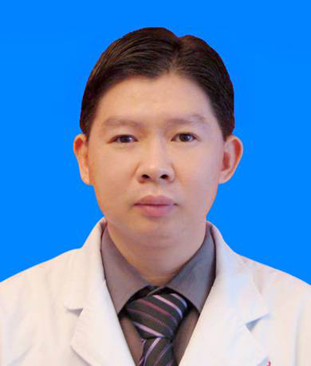

# 彭培建

## 基础信息

| 字段 | 内容 |
|---|---|
| 姓名 | 彭培建 |
| 医院 | 中山大学附属第五医院 |
| 科室 | 乳腺肿瘤内科 |
| 职称/身份 | 乳腺病科主任，主任医师，肿瘤学博士，硕士生导师。 |
| 重点优先级 | 高 |
| 来源链接 | https://www.sysu5.cn/medical-service/department-expert/doctor/10470 |
| 采集日期 | 2026-08-08 |

## 简介/擅长

彭培建医生来自中山大学附属第五医院乳腺肿瘤内科，官网公开资料显示其诊疗线索与肿瘤、免疫/风湿/感染、术后恢复/康复、疑难重症相关。
官网擅长线索：擅长：乳腺良恶性肿瘤的诊治，擅长乳腺癌放化疗、靶向及内分泌治疗。 乳腺癌的放化疗、内分泌治疗及靶向治疗。 对乳腺癌的新辅助治疗、术后辅助治疗以及晚期乳腺癌的治疗具有丰富的临床治疗经验。

## 可包装亮点

- 乳腺病科主任，主任医师，肿瘤学博士，硕士生导师。
- 同时也擅长肺癌的放化疗、靶向及免疫等多学科综合治疗，特别是在肺癌“免化疗”治疗方面具有丰富的临床经验。
- 现任中国临床肿瘤学会（CSCO）理事会理事、CSCO神经系统肿瘤专家委员会常委、广东省医师协会肿瘤内科分会常委、广东省抗癌协会肿瘤化疗专业委员会委员、广东省胸部疾病学会免疫治疗专业委员会常务委员、广东省临床医学会精准医疗专业委员会委员、珠…

## 重点疾病/人群标签

- 慢性病：
- 肿瘤：肿瘤、癌、瘤、化疗、靶向、肺癌、乳腺癌
- 生殖疾病：
- 免疫/风湿：免疫
- 术后恢复/康复：术后
- 疑难重症：多学科

## 证据摘录

> 以下只保留官网公开信息中的短句或关键字段，不复制大段原文。

- 官网身份字段：乳腺病科主任，主任医师，肿瘤学博士，硕士生导师。
- 官网擅长线索：擅长：乳腺良恶性肿瘤的诊治，擅长乳腺癌放化疗、靶向及内分泌治疗。 乳腺癌的放化疗、内分泌治疗及靶向治疗。 对乳腺癌的新辅助治疗、术后辅助治疗以及晚期乳腺癌的治疗具有丰富的临床治疗经验。
- 官网经历线索：乳腺病科主任，主任医师，肿瘤学博士，硕士生导师。 同时也擅长肺癌的放化疗、靶向及免疫等多学科综合治疗，特别是在肺癌“免化疗”治疗方面具有丰富的临床经验。 现任中国临床肿瘤学会（CSCO）理事会理事、CSCO神经系统肿瘤专家委员会常委、广东省医师协会肿瘤内科分会常委、广东省抗癌协会肿瘤化疗专业委员会委员、广东省胸部疾病…
- 来源链接：https://www.sysu5.cn/medical-service/department-expert/doctor/10470

## BD 画像摘要

彭培建医生可作为肿瘤、免疫/风湿/感染、术后恢复/康复、疑难重症方向的医生画像候选。后续 BD 包装应围绕官网已展示的科室、职称、擅长和经历线索展开，保持待人工复核状态，不添加疗效承诺。

## 合规边界

- 本条画像仅基于医院官网公开医生详情页整理。
- 未采集私人联系方式、患者案例、非公开排班或第三方评价。
- 所有亮点均需保留来源链接，不得改写为治疗效果承诺。
