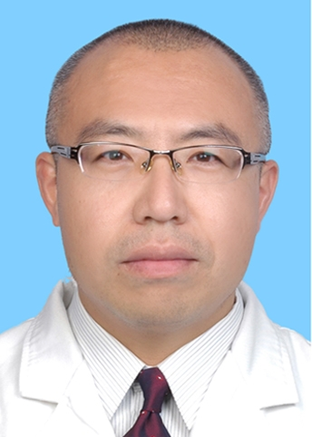

# 徐景勃

## 基础信息

| 字段 | 内容 |
|---|---|
| 姓名 | 徐景勃 |
| 医院 | 中山大学附属第五医院 |
| 科室 | 血液内科 |
| 职称/身份 | 血液内科副主任（主持工作），主任医师，医学博士，硕士生导师。 |
| 重点优先级 | 高 |
| 来源链接 | https://www.sysu5.cn/medical-service/department-expert/doctor/1270 |
| 采集日期 | 2026-08-08 |

## 简介/擅长

徐景勃医生来自中山大学附属第五医院血液内科，官网公开资料显示其诊疗线索与慢性病、肿瘤、免疫/风湿/感染、疑难重症相关。
官网擅长线索：熟练应用造血干细胞移植技术治疗白血病、淋巴瘤、多发性骨髓瘤等恶性血液病及重症红斑狼疮等难治性风湿性疾病。 研究方向：造血干细胞移植治疗白血病、骨髓瘤和淋巴瘤。

## 可包装亮点

- 血液内科副主任（主持工作），主任医师，医学博士，硕士生导师。
- 1994年毕业于沈阳医学院医疗系，2010年中山大学硕士研究生毕业，2022年晋升为主任医师。
- 学术任职：珠海市医学会第八届第九届理事会理事，珠海市医学会血液和风湿病学分会主任委员，广东省医师协会血液科医师分会常务委员，广东省健康管理学会血液病学专业委员会常务委员，CSCO中国自体造血干细胞移植工作组成员。

## 重点疾病/人群标签

- 慢性病：慢性
- 肿瘤：瘤、淋巴瘤、白血病
- 生殖疾病：
- 免疫/风湿：风湿、红斑狼疮
- 术后恢复/康复：
- 疑难重症：重症、难治

## 证据摘录

> 以下只保留官网公开信息中的短句或关键字段，不复制大段原文。

- 官网身份字段：血液内科副主任（主持工作），主任医师，医学博士，硕士生导师。
- 官网擅长线索：熟练应用造血干细胞移植技术治疗白血病、淋巴瘤、多发性骨髓瘤等恶性血液病及重症红斑狼疮等难治性风湿性疾病。 研究方向：造血干细胞移植治疗白血病、骨髓瘤和淋巴瘤。
- 官网经历线索：血液内科副主任（主持工作），主任医师，医学博士，硕士生导师。 1994年毕业于沈阳医学院医疗系，2010年中山大学硕士研究生毕业，2022年晋升为主任医师。 学术任职：珠海市医学会第八届第九届理事会理事，珠海市医学会血液和风湿病学分会主任委员，广东省医师协会血液科医师分会常务委员，广东省健康管理学会血液病学专业委员会…
- 来源链接：https://www.sysu5.cn/medical-service/department-expert/doctor/1270

## BD 画像摘要

徐景勃医生可作为慢性病、肿瘤、免疫/风湿/感染、疑难重症方向的医生画像候选。后续 BD 包装应围绕官网已展示的科室、职称、擅长和经历线索展开，保持待人工复核状态，不添加疗效承诺。

## 合规边界

- 本条画像仅基于医院官网公开医生详情页整理。
- 未采集私人联系方式、患者案例、非公开排班或第三方评价。
- 所有亮点均需保留来源链接，不得改写为治疗效果承诺。
