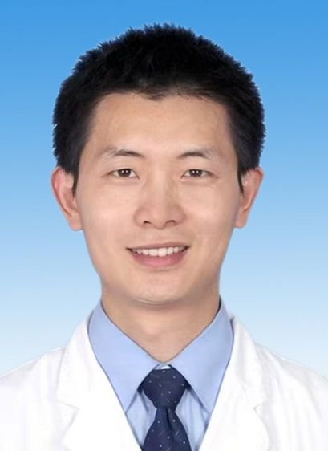

# 徐西伟

## 基础信息

| 字段 | 内容 |
|---|---|
| 姓名 | 徐西伟 |
| 医院 | 中山大学附属第五医院 |
| 科室 | 头颈部肿瘤/放射肿瘤相关专业（官网详情页未单列科室，待复核） |
| 职称/身份 | 副主任医师、医学硕士 |
| 来源链接 | https://www.sysu5.cn/medical-service/department-expert/doctor/10893 |
| 采集日期 | 2026-08-08 |

## 简介/擅长

徐西伟医生来自中山大学附属第五医院头颈部肿瘤及放射肿瘤相关方向。官网介绍其擅长头颈肿瘤、淋巴瘤、软组织肿瘤放疗和疤痕等良性病放疗，并长期从事头颈部肿瘤治疗工作。

## 可包装亮点

- 副主任医师、医学硕士，适合归入头颈部肿瘤与放射治疗方向医生画像。
- 官网显示其从事头颈部肿瘤治疗工作近 20 年，可作为长期专科经验亮点。
- 重点方向覆盖舌癌、颊粘膜癌、牙龈癌、扁桃体癌、喉癌、下咽癌、腮腺癌、鼻腔鼻窦癌、鼻咽癌等头颈部肿瘤，适合与头颈部复杂肿瘤方向关联分析。
- 官网提到其擅长淋巴瘤放疗、软组织肿瘤放疗及良性病放疗，可作为放疗亚专科覆盖面证据。
- 官网显示其担任珠海市放射治疗质控中心秘书，以及多个放射肿瘤、肿瘤学、淋巴瘤相关专业组织职务，可作为区域放疗专业影响力证据。
- 官网提到其研究方向为头颈部肿瘤自适应调强放疗、淋巴瘤及良性病放疗，可作为技术方向标签。
- 官网显示其获得 2021 年“五院最美医生”，可作为院内荣誉补充。

## 重点疾病/人群标签

- 慢性病：无直接证据，暂不标记
- 肿瘤：头颈部肿瘤、淋巴瘤、软组织肿瘤、舌癌、颊粘膜癌、牙龈癌、扁桃体癌、喉癌、下咽癌、腮腺癌、鼻腔鼻窦癌、鼻咽癌
- 生殖疾病：无直接证据，暂不标记
- 免疫/风湿：无直接证据，暂不标记
- 术后恢复/康复：无直接证据，暂不标记
- 疑难重症：可标记为头颈部复杂肿瘤、淋巴瘤放疗、自适应调强放疗方向

## 证据摘录

- 官网字段：副主任医师，医学硕士。
- 官网擅长：头颈肿瘤、淋巴瘤、软组织肿瘤放疗和疤痕等良性病放疗。
- 官网信息显示其从事头颈部肿瘤治疗工作近 20 年。
- 官网信息显示其研究方向为头颈部肿瘤自适应调强放疗、淋巴瘤及良性病放疗。

## BD 画像摘要

徐西伟医生可作为“头颈部肿瘤、淋巴瘤与放射治疗方向”的医生画像样本。其画像适合围绕“近 20 年头颈部肿瘤治疗经验、头颈多癌种放化疗、淋巴瘤和软组织肿瘤放疗、放射治疗质控与专业组织任职、自适应调强放疗研究方向”展开。对外包装时应坚持证据化表达，不使用治疗效果承诺。

## 合规边界

- 本条画像仅基于中山大学附属第五医院官网公开医生详情页整理。
- 官网详情页未单列“科室”字段，本画像将其标注为头颈部肿瘤/放射肿瘤相关专业，后续需人工复核实际科室。
- 未采集私人联系方式、患者案例、非公开排班或第三方评价。
- 所有“亮点”均需保留来源链接，不得改写为治疗效果承诺。
