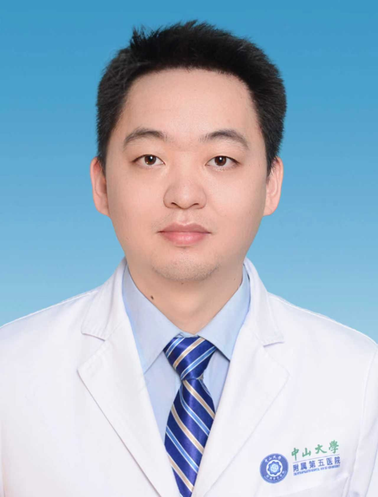

# 敖峰

## 基础信息

| 字段 | 内容 |
|---|---|
| 姓名 | 敖峰 |
| 医院 | 中山大学附属第五医院 |
| 科室 | 脑血管病中心 |
| 职称/身份 | 副主任医师，医学博士，硕士生导师。 |
| 重点优先级 | 高 |
| 来源链接 | https://www.sysu5.cn/medical-service/department-expert/doctor/2388 |
| 采集日期 | 2026-08-08 |

## 简介/擅长

敖峰医生来自中山大学附属第五医院脑血管病中心，官网公开资料显示其诊疗线索与肿瘤相关。
官网擅长线索：本硕博均毕业于中山大学中山医学院，从事脑血管疾病介入诊疗十余年，擅长脑动脉瘤、脑血管狭窄、颈动脉狭窄、颅内动静脉畸形/瘘及脑卒中等疾病的诊治，是珠海地区急性脑卒中取栓工作重要成员之一。

## 可包装亮点

- 副主任医师，医学博士，硕士生导师。
- 以第一作者及第一作者发表高水平SCI及国内核心期刊论文多篇。

## 重点疾病/人群标签

- 慢性病：
- 肿瘤：瘤
- 生殖疾病：
- 免疫/风湿：
- 术后恢复/康复：
- 疑难重症：

## 证据摘录

> 以下只保留官网公开信息中的短句或关键字段，不复制大段原文。

- 官网身份字段：副主任医师，医学博士，硕士生导师。
- 官网擅长线索：本硕博均毕业于中山大学中山医学院，从事脑血管疾病介入诊疗十余年，擅长脑动脉瘤、脑血管狭窄、颈动脉狭窄、颅内动静脉畸形/瘘及脑卒中等疾病的诊治，是珠海地区急性脑卒中取栓工作重要成员之一。
- 官网经历线索：副主任医师，医学博士，硕士生导师。 以第一作者及第一作者发表高水平SCI及国内核心期刊论文多篇。
- 来源链接：https://www.sysu5.cn/medical-service/department-expert/doctor/2388

## BD 画像摘要

敖峰医生可作为肿瘤方向的医生画像候选。后续 BD 包装应围绕官网已展示的科室、职称、擅长和经历线索展开，保持待人工复核状态，不添加疗效承诺。

## 合规边界

- 本条画像仅基于医院官网公开医生详情页整理。
- 未采集私人联系方式、患者案例、非公开排班或第三方评价。
- 所有亮点均需保留来源链接，不得改写为治疗效果承诺。
