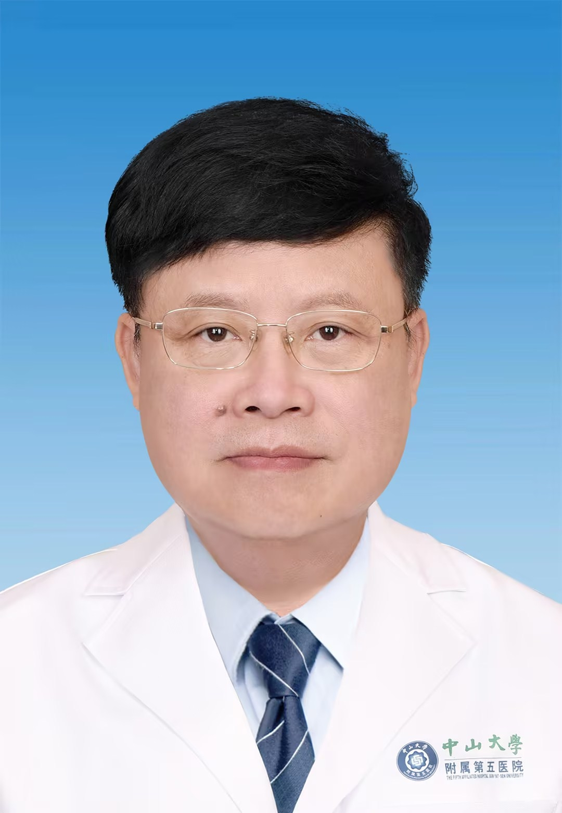

# 曾骏文

## 基础信息

| 字段 | 内容 |
|---|---|
| 姓名 | 曾骏文 |
| 医院 | 中山大学附属第五医院 |
| 科室 | 眼科 |
| 职称/身份 | 主任医师，教授，博士生导师 |
| 重点优先级 | 高 |
| 来源链接 | https://www.sysu5.cn/medical-service/department-expert/doctor/10720 |
| 采集日期 | 2026-08-08 |

## 简介/擅长

曾骏文医生来自中山大学附属第五医院眼科，官网公开资料中可提取到术后恢复/康复方向线索。

## 可包装亮点

- 主任医师，教授，博士生导师 主任医师，教授，博士生导师 于 1993年赴美深造，长期从事青少年近视防治工作，有丰富眼科常见病临床经验，负责多项国家和省部级眼科究课题，核心期刊发表论文 90 多篇，是多项国家和省部级科技进步奖的主要成员。
- 中华眼科医师协会临床视光与眼保健专业委员会主任申残联康复工程与辅助技术专业委员会副主任全国卫生产业管理协会视光产业分会副会长。

## 重点疾病/人群标签

- 慢性病：
- 肿瘤：
- 生殖疾病：
- 免疫/风湿：
- 术后恢复/康复：康复
- 疑难重症：

## 证据摘录

> 以下只保留官网公开信息中的短句或关键字段，不复制大段原文。

- 官网身份字段：主任医师，教授，博士生导师
- 官网经历线索：主任医师，教授，博士生导师 主任医师，教授，博士生导师 于 1993年赴美深造，长期从事青少年近视防治工作，有丰富眼科常见病临床经验，负责多项国家和省部级眼科究课题，核心期刊发表论文 90 多篇，是多项国家和省部级科技进步奖的主要成员。 中华眼科医师协会临床视光与眼保健专业委员会主任申残联康复工程与辅助技术专业委员会…
- 来源链接：https://www.sysu5.cn/medical-service/department-expert/doctor/10720

## BD 画像摘要

曾骏文医生可作为术后恢复/康复方向的医生画像候选。后续 BD 包装应围绕官网已展示的科室、职称、擅长和经历线索展开，保持待人工复核状态，不添加疗效承诺。

## 合规边界

- 本条画像仅基于医院官网公开医生详情页整理。
- 未采集私人联系方式、患者案例、非公开排班或第三方评价。
- 所有亮点均需保留来源链接，不得改写为治疗效果承诺。
