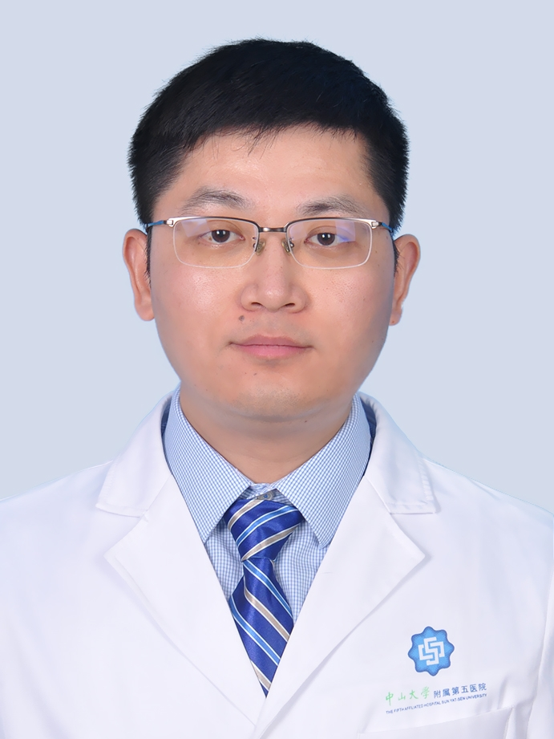

# 李亚伟

## 基础信息

| 字段 | 内容 |
|---|---|
| 姓名 | 李亚伟 |
| 医院 | 中山大学附属第五医院 |
| 科室 | 泌尿外科 |
| 职称/身份 | 泌尿外科副主任，副主任医师，医学博士，硕士生导师。 |
| 重点优先级 | 高 |
| 来源链接 | https://www.sysu5.cn/medical-service/department-expert/doctor/10883 |
| 采集日期 | 2026-08-08 |

## 简介/擅长

李亚伟医生来自中山大学附属第五医院泌尿外科，官网公开资料显示其诊疗线索与肿瘤、生殖疾病相关。
官网擅长线索：从事泌尿外科专科工作12年，对泌尿系肿瘤、结石及前列腺的微创治疗，如腹腔镜肾上腺肿瘤（嗜铬细胞瘤）切除、肾癌根治、肾部分切除、前列腺癌根治等，具有较为丰富的经验，擅长应用钬激光/等离子进行膀胱肿瘤整块切除（en bloc resection）以及前列腺增生剜除。 研究方向为泌尿男生殖系统肿瘤（肾癌、膀胱癌、前列腺癌）诊治新技术及肿瘤发展的分子生物学机制。

## 可包装亮点

- 泌尿外科副主任，副主任医师，医学博士，硕士生导师。
- 2019年9月-11月赴德国哈雷大学附属医院泌尿外科访学3个月。
- 现任中华医学会青委会肿瘤学组委员。

## 重点疾病/人群标签

- 慢性病：
- 肿瘤：肿瘤、癌、瘤
- 生殖疾病：生殖
- 免疫/风湿：
- 术后恢复/康复：
- 疑难重症：

## 证据摘录

> 以下只保留官网公开信息中的短句或关键字段，不复制大段原文。

- 官网身份字段：泌尿外科副主任，副主任医师，医学博士，硕士生导师。
- 官网擅长线索：从事泌尿外科专科工作12年，对泌尿系肿瘤、结石及前列腺的微创治疗，如腹腔镜肾上腺肿瘤（嗜铬细胞瘤）切除、肾癌根治、肾部分切除、前列腺癌根治等，具有较为丰富的经验，擅长应用钬激光/等离子进行膀胱肿瘤整块切除（en bloc resection）以及前列腺增生剜除。 研究方向为泌尿男生殖系统肿瘤（肾癌、膀胱癌、前列腺癌）…
- 官网经历线索：泌尿外科副主任，副主任医师，医学博士，硕士生导师。 2019年9月-11月赴德国哈雷大学附属医院泌尿外科访学3个月。 现任中华医学会青委会肿瘤学组委员。
- 来源链接：https://www.sysu5.cn/medical-service/department-expert/doctor/10883

## BD 画像摘要

李亚伟医生可作为肿瘤、生殖疾病方向的医生画像候选。后续 BD 包装应围绕官网已展示的科室、职称、擅长和经历线索展开，保持待人工复核状态，不添加疗效承诺。

## 合规边界

- 本条画像仅基于医院官网公开医生详情页整理。
- 未采集私人联系方式、患者案例、非公开排班或第三方评价。
- 所有亮点均需保留来源链接，不得改写为治疗效果承诺。
