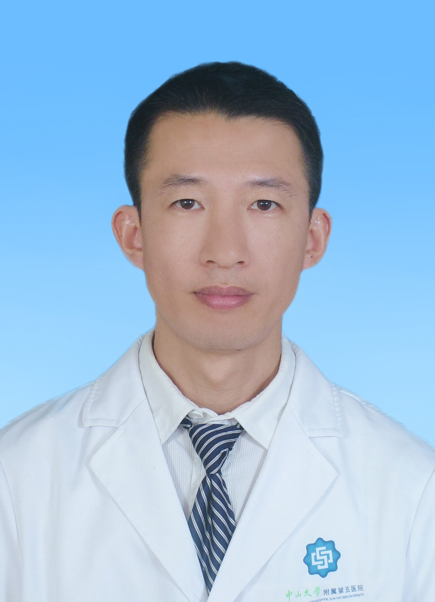

# 李国威

## 基础信息

| 字段 | 内容 |
|---|---|
| 姓名 | 李国威 |
| 医院 | 中山大学附属第五医院 |
| 科室 | 脊柱外科 |
| 职称/身份 | 主治医师，医学硕士。 |
| 重点优先级 | 高 |
| 来源链接 | https://www.sysu5.cn/medical-service/department-expert/doctor/8163 |
| 采集日期 | 2026-08-08 |

## 简介/擅长

李国威医生来自中山大学附属第五医院脊柱外科，官网公开资料显示其诊疗线索与肿瘤、术后恢复/康复相关。
官网擅长线索：从事骨科专业工作近20年，擅长腰腿痛、颈肩痛、椎间盘突出、椎管狭窄、腰椎滑脱、脊柱外伤、脊柱结核、脊柱肿瘤、脊柱侧弯等疾病的诊治，尤其对脊柱疾病的微创治疗及骨肿瘤诊治有丰富的临床经验。

## 可包装亮点

- 2002年中山大学毕业，2017年在中山大学附属第一医院进修骨肿瘤专业。
- 现任广东省医师协会脊柱分会委员，广东省康复医学会脊柱脊髓分会理事，广东省医师协会骨肿瘤分会委员，广东省抗癌协会肉瘤专业委员会委员,珠海市医学会骨科学分会委员,珠海市医师协会脊柱病科分会委员，珠海市医师协会肿瘤医师分会委员，珠海市中西医结合…
- 主持及参与省、市级课题5项，发表专业论文10余篇。

## 重点疾病/人群标签

- 慢性病：
- 肿瘤：肿瘤、癌、瘤
- 生殖疾病：
- 免疫/风湿：
- 术后恢复/康复：康复
- 疑难重症：

## 证据摘录

> 以下只保留官网公开信息中的短句或关键字段，不复制大段原文。

- 官网身份字段：主治医师，医学硕士。
- 官网擅长线索：从事骨科专业工作近20年，擅长腰腿痛、颈肩痛、椎间盘突出、椎管狭窄、腰椎滑脱、脊柱外伤、脊柱结核、脊柱肿瘤、脊柱侧弯等疾病的诊治，尤其对脊柱疾病的微创治疗及骨肿瘤诊治有丰富的临床经验。
- 官网经历线索：2002年中山大学毕业，2017年在中山大学附属第一医院进修骨肿瘤专业。 现任广东省医师协会脊柱分会委员，广东省康复医学会脊柱脊髓分会理事，广东省医师协会骨肿瘤分会委员，广东省抗癌协会肉瘤专业委员会委员,珠海市医学会骨科学分会委员,珠海市医师协会脊柱病科分会委员，珠海市医师协会肿瘤医师分会委员，珠海市中西医结合学会骨…
- 来源链接：https://www.sysu5.cn/medical-service/department-expert/doctor/8163

## BD 画像摘要

李国威医生可作为肿瘤、术后恢复/康复方向的医生画像候选。后续 BD 包装应围绕官网已展示的科室、职称、擅长和经历线索展开，保持待人工复核状态，不添加疗效承诺。

## 合规边界

- 本条画像仅基于医院官网公开医生详情页整理。
- 未采集私人联系方式、患者案例、非公开排班或第三方评价。
- 所有亮点均需保留来源链接，不得改写为治疗效果承诺。
