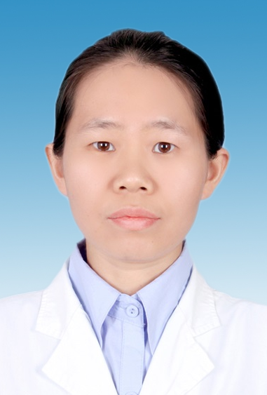

# 李坤炜

## 基础信息

| 字段 | 内容 |
|---|---|
| 姓名 | 李坤炜 |
| 医院 | 中山大学附属第五医院 |
| 科室 | 放射科 |
| 职称/身份 | 副主任医师，医学硕士。 |
| 重点优先级 | 高 |
| 来源链接 | https://www.sysu5.cn/medical-service/department-expert/doctor/11723 |
| 采集日期 | 2026-08-08 |

## 简介/擅长

李坤炜医生来自中山大学附属第五医院放射科，官网公开资料显示其诊疗线索与肿瘤相关。
官网擅长线索：从事医学影像诊断工作20余年，国际早期肺癌筛查行动计划（I-ELCAP）访问学者。 擅长胸腹部疾病影像诊断，尤其在肺结节诊断及管理上有丰富的临床经验。

## 可包装亮点

- 副主任医师，医学硕士。
- 从事医学影像诊断工作20余年，国际早期肺癌筛查行动计划（I-ELCAP）访问学者。
- 现任珠海市医学会结核病学分会常委，广东省医学会影像技术学会分子影像与大数据学组委员，广东省抗癌学会肿瘤影像专业委员会青年委员会委员。

## 重点疾病/人群标签

- 慢性病：
- 肿瘤：肿瘤、癌、瘤、肺癌
- 生殖疾病：
- 免疫/风湿：
- 术后恢复/康复：
- 疑难重症：

## 证据摘录

> 以下只保留官网公开信息中的短句或关键字段，不复制大段原文。

- 官网身份字段：副主任医师，医学硕士。
- 官网擅长线索：从事医学影像诊断工作20余年，国际早期肺癌筛查行动计划（I-ELCAP）访问学者。 擅长胸腹部疾病影像诊断，尤其在肺结节诊断及管理上有丰富的临床经验。
- 官网经历线索：副主任医师，医学硕士。 从事医学影像诊断工作20余年，国际早期肺癌筛查行动计划（I-ELCAP）访问学者。 现任珠海市医学会结核病学分会常委，广东省医学会影像技术学会分子影像与大数据学组委员，广东省抗癌学会肿瘤影像专业委员会青年委员会委员。
- 来源链接：https://www.sysu5.cn/medical-service/department-expert/doctor/11723

## BD 画像摘要

李坤炜医生可作为肿瘤方向的医生画像候选。后续 BD 包装应围绕官网已展示的科室、职称、擅长和经历线索展开，保持待人工复核状态，不添加疗效承诺。

## 合规边界

- 本条画像仅基于医院官网公开医生详情页整理。
- 未采集私人联系方式、患者案例、非公开排班或第三方评价。
- 所有亮点均需保留来源链接，不得改写为治疗效果承诺。
