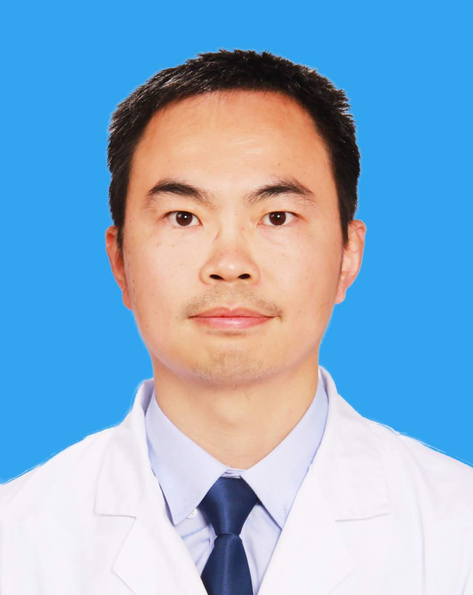

# 李毅

## 基础信息

| 字段 | 内容 |
|---|---|
| 姓名 | 李毅 |
| 医院 | 中山大学附属第五医院 |
| 科室 | 甲状腺乳腺外科 |
| 职称/身份 | 副主任医师，医学博士，硕士生导师。 |
| 重点优先级 | 高 |
| 来源链接 | https://www.sysu5.cn/medical-service/department-expert/doctor/3119 |
| 采集日期 | 2026-08-08 |

## 简介/擅长

李毅医生来自中山大学附属第五医院甲状腺乳腺外科，官网公开资料显示其诊疗线索与肿瘤、疑难重症相关。
官网擅长线索：从事外科临床工作10余年，年手术量约500余例，在甲状腺癌、乳腺癌规范化外科治疗方面经验丰富。 擅长于甲状腺癌、乳腺癌的规范化及微创外科手术治疗，在甲状腺癌及乳腺癌疑难重症方面有丰富经验及独到见解。

## 可包装亮点

- 副主任医师，医学博士，硕士生导师。
- 擅长于甲状腺癌、乳腺癌的规范化及微创外科手术治疗，在甲状腺癌及乳腺癌疑难重症方面有丰富经验及独到见解。
- 珠海抗癌协会甲状腺专业委员会秘书、广东省临床医学学会甲状腺专业委员会青年委员、珠海抗癌协会乳腺癌专业委员会委员。

## 重点疾病/人群标签

- 慢性病：
- 肿瘤：癌、乳腺癌
- 生殖疾病：
- 免疫/风湿：
- 术后恢复/康复：
- 疑难重症：疑难、重症

## 证据摘录

> 以下只保留官网公开信息中的短句或关键字段，不复制大段原文。

- 官网身份字段：副主任医师，医学博士，硕士生导师。
- 官网擅长线索：从事外科临床工作10余年，年手术量约500余例，在甲状腺癌、乳腺癌规范化外科治疗方面经验丰富。 擅长于甲状腺癌、乳腺癌的规范化及微创外科手术治疗，在甲状腺癌及乳腺癌疑难重症方面有丰富经验及独到见解。
- 官网经历线索：副主任医师，医学博士，硕士生导师。 擅长于甲状腺癌、乳腺癌的规范化及微创外科手术治疗，在甲状腺癌及乳腺癌疑难重症方面有丰富经验及独到见解。 珠海抗癌协会甲状腺专业委员会秘书、广东省临床医学学会甲状腺专业委员会青年委员、珠海抗癌协会乳腺癌专业委员会委员。
- 来源链接：https://www.sysu5.cn/medical-service/department-expert/doctor/3119

## BD 画像摘要

李毅医生可作为肿瘤、疑难重症方向的医生画像候选。后续 BD 包装应围绕官网已展示的科室、职称、擅长和经历线索展开，保持待人工复核状态，不添加疗效承诺。

## 合规边界

- 本条画像仅基于医院官网公开医生详情页整理。
- 未采集私人联系方式、患者案例、非公开排班或第三方评价。
- 所有亮点均需保留来源链接，不得改写为治疗效果承诺。
