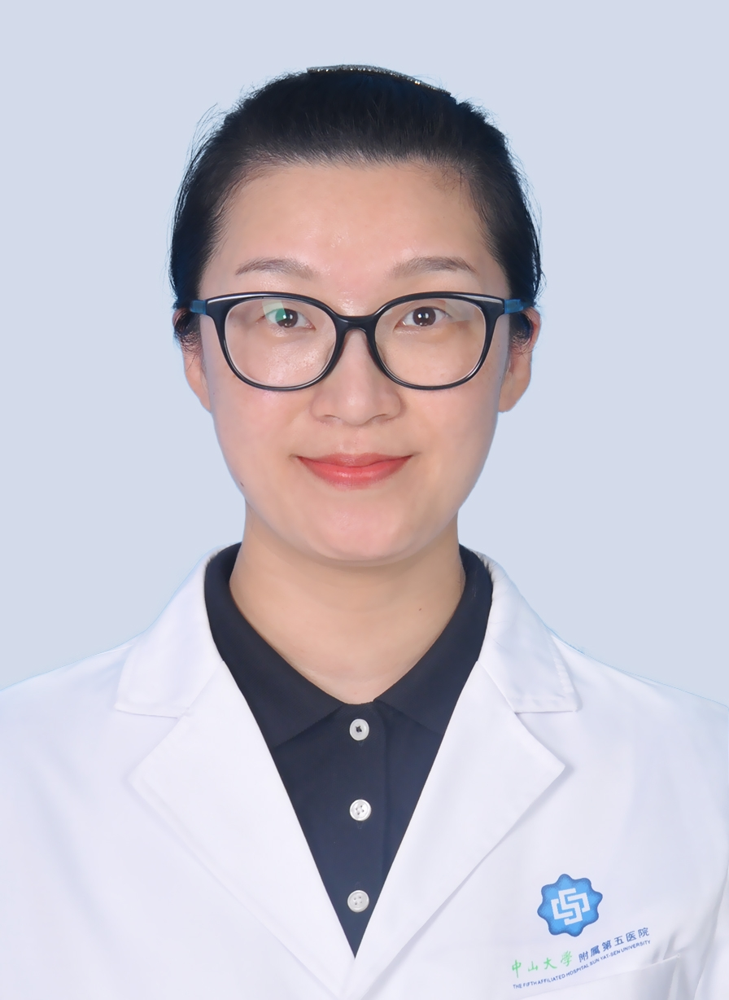

# 李秋实

## 基础信息

| 字段 | 内容 |
|---|---|
| 姓名 | 李秋实 |
| 医院 | 中山大学附属第五医院 |
| 科室 | 口腔科 |
| 职称/身份 | 副教授，副主任医师，医学博士，硕士生导师。 |
| 重点优先级 | 高 |
| 来源链接 | https://www.sysu5.cn/medical-service/department-expert/doctor/10740 |
| 采集日期 | 2026-08-08 |

## 简介/擅长

李秋实医生来自中山大学附属第五医院口腔科，官网公开资料显示其诊疗线索与疑难重症相关。
官网擅长线索：擅长各类义齿修复，尤其擅长吸附性全口义齿，固定义齿如瓷贴面美学修复、冠修复等，活动义齿，种植义齿，颌骨及腭部赝复体，咬合重建等。 此外，对美学树脂充填，激光治疗牙本质敏感症及激光牙龈成形术等经验丰富。 主持省级、校级及院级科研项目各1项，研究方向为激光医疗及口腔微生物。

## 可包装亮点

- 副教授，副主任医师，医学博士，硕士生导师。
- 2017年于北京大学口腔医院修复科进修，专攻全口义齿和瓷贴面。
- 现任中华口腔医学会口腔激光医学专委会青年委员，广东省口腔医学会修复学专委会委员，广东省预防医学会口腔疾病防治专委会委员，珠海市家庭医生协会口腔分会专委会委员。

## 重点疾病/人群标签

- 慢性病：
- 肿瘤：
- 生殖疾病：
- 免疫/风湿：
- 术后恢复/康复：
- 疑难重症：复杂

## 证据摘录

> 以下只保留官网公开信息中的短句或关键字段，不复制大段原文。

- 官网身份字段：副教授，副主任医师，医学博士，硕士生导师。
- 官网擅长线索：擅长各类义齿修复，尤其擅长吸附性全口义齿，固定义齿如瓷贴面美学修复、冠修复等，活动义齿，种植义齿，颌骨及腭部赝复体，咬合重建等。 此外，对美学树脂充填，激光治疗牙本质敏感症及激光牙龈成形术等经验丰富。 主持省级、校级及院级科研项目各1项，研究方向为激光医疗及口腔微生物。
- 官网经历线索：副教授，副主任医师，医学博士，硕士生导师。 2017年于北京大学口腔医院修复科进修，专攻全口义齿和瓷贴面。 现任中华口腔医学会口腔激光医学专委会青年委员，广东省口腔医学会修复学专委会委员，广东省预防医学会口腔疾病防治专委会委员，珠海市家庭医生协会口腔分会专委会委员。
- 来源链接：https://www.sysu5.cn/medical-service/department-expert/doctor/10740

## BD 画像摘要

李秋实医生可作为疑难重症方向的医生画像候选。后续 BD 包装应围绕官网已展示的科室、职称、擅长和经历线索展开，保持待人工复核状态，不添加疗效承诺。

## 合规边界

- 本条画像仅基于医院官网公开医生详情页整理。
- 未采集私人联系方式、患者案例、非公开排班或第三方评价。
- 所有亮点均需保留来源链接，不得改写为治疗效果承诺。
