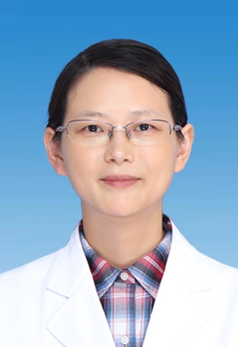

# 杨轶男

## 基础信息

| 字段 | 内容 |
|---|---|
| 姓名 | 杨轶男 |
| 医院 | 中山大学附属第五医院 |
| 科室 | 儿科 |
| 职称/身份 | 综合儿科副主任，主任医师，副教授，医学博士。 |
| 重点优先级 | 高 |
| 来源链接 | https://www.sysu5.cn/medical-service/department-expert/doctor/10141 |
| 采集日期 | 2026-08-08 |

## 简介/擅长

杨轶男医生来自中山大学附属第五医院儿科，官网公开资料显示其诊疗线索与免疫/风湿/感染、疑难重症相关。
官网擅长线索：2005年从兰州大学医疗系毕业后一直从事儿科临床、教学及科研工作，曾在北京儿童医院、广东省人民医院进修学习，擅长儿童常见病、多发病的诊治，尤其对呼吸系统、心血管系统及过敏性疾病的诊治具有丰富的临床经验。

## 可包装亮点

- 综合儿科副主任，主任医师，副教授，医学博士。
- 美国布朗大学访问学者。
- 2005年从兰州大学医疗系毕业后一直从事儿科临床、教学及科研工作，曾在北京儿童医院、广东省人民医院进修学习，擅长儿童常见病、多发病的诊治，尤其对呼吸系统、心血管系统及过敏性疾病的诊治具有丰富的临床经验。

## 重点疾病/人群标签

- 慢性病：
- 肿瘤：
- 生殖疾病：
- 免疫/风湿：免疫
- 术后恢复/康复：
- 疑难重症：重症

## 证据摘录

> 以下只保留官网公开信息中的短句或关键字段，不复制大段原文。

- 官网身份字段：综合儿科副主任，主任医师，副教授，医学博士。
- 官网擅长线索：2005年从兰州大学医疗系毕业后一直从事儿科临床、教学及科研工作，曾在北京儿童医院、广东省人民医院进修学习，擅长儿童常见病、多发病的诊治，尤其对呼吸系统、心血管系统及过敏性疾病的诊治具有丰富的临床经验。
- 官网经历线索：综合儿科副主任，主任医师，副教授，医学博士。 美国布朗大学访问学者。 2005年从兰州大学医疗系毕业后一直从事儿科临床、教学及科研工作，曾在北京儿童医院、广东省人民医院进修学习，擅长儿童常见病、多发病的诊治，尤其对呼吸系统、心血管系统及过敏性疾病的诊治具有丰富的临床经验。
- 来源链接：https://www.sysu5.cn/medical-service/department-expert/doctor/10141

## BD 画像摘要

杨轶男医生可作为免疫/风湿/感染、疑难重症方向的医生画像候选。后续 BD 包装应围绕官网已展示的科室、职称、擅长和经历线索展开，保持待人工复核状态，不添加疗效承诺。

## 合规边界

- 本条画像仅基于医院官网公开医生详情页整理。
- 未采集私人联系方式、患者案例、非公开排班或第三方评价。
- 所有亮点均需保留来源链接，不得改写为治疗效果承诺。
