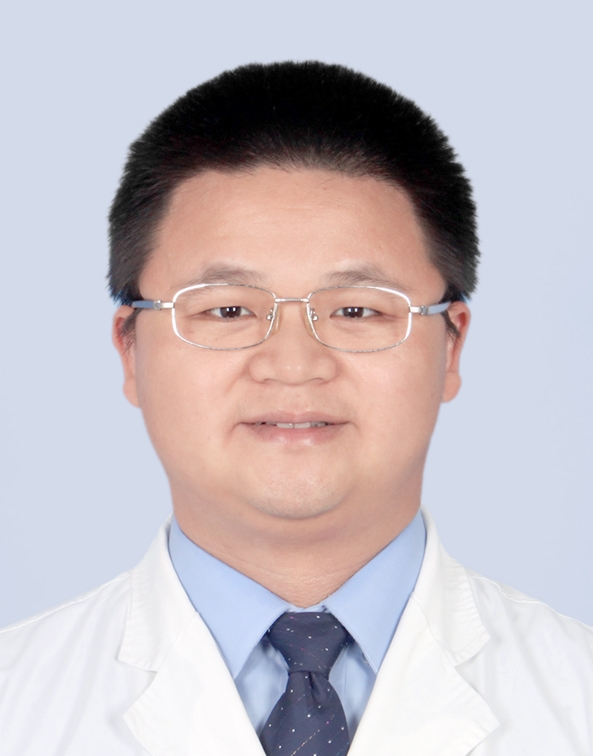

# 梁子彬

## 基础信息

| 字段 | 内容 |
|---|---|
| 姓名 | 梁子彬 |
| 医院 | 中山大学附属第五医院 |
| 科室 | 肿瘤学、放射肿瘤学（官网字段为学科专业，非科室名） |
| 职称/身份 | 副主任医师、医学博士、硕士生导师 |
| 来源链接 | https://www.sysu5.cn/medical-service/department-expert/doctor/10298 |
| 采集日期 | 2026-08-08 |

## 简介/擅长

梁子彬医生来自中山大学附属第五医院肿瘤学、放射肿瘤学方向。官网介绍其从事肿瘤专科工作 23 年，擅长胸部肿瘤、脑转移瘤及肿瘤相关损伤的早期诊治、靶向与免疫治疗，并聚焦肿瘤精准放射治疗技术及靶区设计。

## 可包装亮点

- 副主任医师、医学博士、硕士生导师，适合归入肿瘤放疗与精准治疗方向医生画像。
- 官网显示其为“广东省南粤好医生”，可作为区域专业荣誉证据。
- 重点方向覆盖胸部肿瘤、脑转移瘤、肺癌、食管癌、纵隔肿瘤、乳腺癌，适合与肿瘤患者方向进行关联分析。
- 官网提到其擅长靶向与免疫治疗、精准放射治疗技术及靶区设计，可标记为复杂肿瘤精准治疗方向。
- 官网显示其领衔“精准放疗创新技术”工作室，并开展肺癌精准放疗、乳腺癌大分割放疗等新技术，可作为学科技术亮点。
- 官网提到其主持国家自然科学基金、省级项目等科研项目，并有专利授权和转化经历，可作为科研与临床转化证据。
- 官网显示其参与抗击“非典”及“新冠”肺炎一线救治工作，可作为公共卫生重大事件参与经历。

## 重点疾病/人群标签

- 慢性病：无直接证据，暂不标记
- 肿瘤：胸部肿瘤、脑转移瘤、肺癌、食管癌、纵隔肿瘤、乳腺癌
- 生殖疾病：无直接证据，暂不标记
- 免疫/风湿：涉及免疫治疗，但不是免疫功能低下或风湿免疫疾病证据，暂不按该人群标记
- 术后恢复/康复：官网提到放疗副反应及损伤处理，可作为肿瘤治疗相关损伤管理线索，需复核具体服务边界
- 疑难重症：可标记为脑转移瘤、复杂胸部肿瘤、精准放疗、靶向与免疫治疗方向

## 证据摘录

- 官网字段：副主任医师，医学博士，硕士生导师，“广东省南粤好医生”。
- 官网擅长：胸部肿瘤、脑转移瘤及肿瘤相关损伤的早期诊治、靶向与免疫治疗。
- 官网信息显示其聚焦肿瘤精准放射治疗技术及靶区设计，涉及肺肿瘤及脑转移瘤 SBRT 等新技术。
- 官网字段：学科专业为肿瘤学、放射肿瘤学。

## BD 画像摘要

梁子彬医生可作为“胸部肿瘤、脑转移瘤、精准放疗与靶向/免疫治疗方向”的医生画像样本。其画像适合围绕“放射肿瘤学背景、精准放疗创新技术、胸部肿瘤和脑转移瘤诊疗、科研项目和专利转化、公共卫生一线救治经历”展开。对外包装时应坚持证据化表达，不使用治疗效果承诺。

## 合规边界

- 本条画像仅基于中山大学附属第五医院官网公开医生详情页整理。
- 官网详情页未单列“科室”字段，本画像将“肿瘤学、放射肿瘤学”标注为官网学科专业，后续需人工复核是否对应实际科室。
- 未采集私人联系方式、患者案例、非公开排班或第三方评价。
- 所有“亮点”均需保留来源链接，不得改写为治疗效果承诺。
