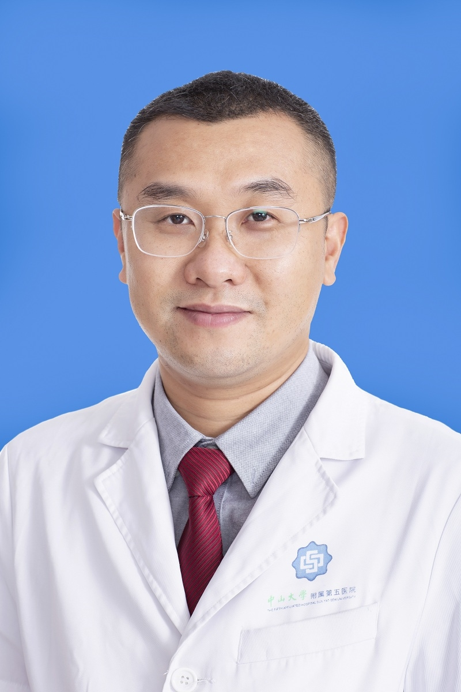

# 江东

## 基础信息

| 字段 | 内容 |
|---|---|
| 姓名 | 江东 |
| 医院 | 中山大学附属第五医院 |
| 科室 | 泌尿外科 |
| 职称/身份 | 副主任医师 ，医学硕士。 |
| 重点优先级 | 高 |
| 来源链接 | https://www.sysu5.cn/medical-service/department-expert/doctor/10897 |
| 采集日期 | 2026-08-08 |

## 简介/擅长

江东医生来自中山大学附属第五医院泌尿外科，官网公开资料显示其诊疗线索与肿瘤、生殖疾病相关。
官网擅长线索：擅长诊治泌尿系结石、前列腺疾病、泌尿系肿瘤、男性科疾病等，具有丰富的实际临床诊治经验。

## 可包装亮点

- 副主任医师 ，医学硕士。
- 广东省泌尿生殖协会不育不孕学会委员、珠海市医学会泌尿外科分会委员、珠海市医学会男科学分会委员、珠海市抗癌协会委员。
- 主持市局级课题2项，参与市局级课题2项，以第一作者及通讯作者发表中华系列等高水平论文7篇，主编50万字专著一本。

## 重点疾病/人群标签

- 慢性病：
- 肿瘤：肿瘤、癌、瘤
- 生殖疾病：生殖、不孕
- 免疫/风湿：
- 术后恢复/康复：
- 疑难重症：

## 证据摘录

> 以下只保留官网公开信息中的短句或关键字段，不复制大段原文。

- 官网身份字段：副主任医师 ，医学硕士。
- 官网擅长线索：擅长诊治泌尿系结石、前列腺疾病、泌尿系肿瘤、男性科疾病等，具有丰富的实际临床诊治经验。
- 官网经历线索：副主任医师 ，医学硕士。 广东省泌尿生殖协会不育不孕学会委员、珠海市医学会泌尿外科分会委员、珠海市医学会男科学分会委员、珠海市抗癌协会委员。 主持市局级课题2项，参与市局级课题2项，以第一作者及通讯作者发表中华系列等高水平论文7篇，主编50万字专著一本。
- 来源链接：https://www.sysu5.cn/medical-service/department-expert/doctor/10897

## BD 画像摘要

江东医生可作为肿瘤、生殖疾病方向的医生画像候选。后续 BD 包装应围绕官网已展示的科室、职称、擅长和经历线索展开，保持待人工复核状态，不添加疗效承诺。

## 合规边界

- 本条画像仅基于医院官网公开医生详情页整理。
- 未采集私人联系方式、患者案例、非公开排班或第三方评价。
- 所有亮点均需保留来源链接，不得改写为治疗效果承诺。
