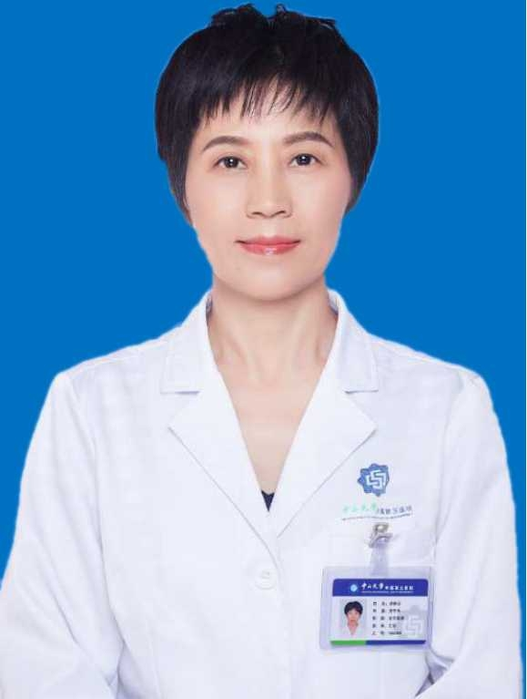

# 涂秋云

## 基础信息

| 字段 | 内容 |
|---|---|
| 姓名 | 涂秋云 |
| 医院 | 中山大学附属第五医院 |
| 科室 | 老年病科 |
| 职称/身份 | 老年病科主任，教授，主任医师，博士，博士生导师。 |
| 重点优先级 | 高 |
| 来源链接 | https://www.sysu5.cn/medical-service/department-expert/doctor/10692 |
| 采集日期 | 2026-08-08 |

## 简介/擅长

涂秋云医生来自中山大学附属第五医院老年病科，官网公开资料显示其诊疗线索与免疫/风湿/感染相关。
官网擅长线索：擅长：老年痴呆、脑血管病、头痛头晕、失眠、少肌症。

## 可包装亮点

- 老年病科主任，教授，主任医师，博士，博士生导师。
- 学科带头人，2012年获中南大学博士学位，2010-2011留学美国新墨西哥大学脑研究中心。
- 担任中国医师协会老年医学分会委员；

## 重点疾病/人群标签

- 慢性病：
- 肿瘤：
- 生殖疾病：
- 免疫/风湿：免疫
- 术后恢复/康复：
- 疑难重症：

## 证据摘录

> 以下只保留官网公开信息中的短句或关键字段，不复制大段原文。

- 官网身份字段：老年病科主任，教授，主任医师，博士，博士生导师。
- 官网擅长线索：擅长：老年痴呆、脑血管病、头痛头晕、失眠、少肌症。
- 官网经历线索：老年病科主任，教授，主任医师，博士，博士生导师。 学科带头人，2012年获中南大学博士学位，2010-2011留学美国新墨西哥大学脑研究中心。 担任中国医师协会老年医学分会委员；
- 来源链接：https://www.sysu5.cn/medical-service/department-expert/doctor/10692

## BD 画像摘要

涂秋云医生可作为免疫/风湿/感染方向的医生画像候选。后续 BD 包装应围绕官网已展示的科室、职称、擅长和经历线索展开，保持待人工复核状态，不添加疗效承诺。

## 合规边界

- 本条画像仅基于医院官网公开医生详情页整理。
- 未采集私人联系方式、患者案例、非公开排班或第三方评价。
- 所有亮点均需保留来源链接，不得改写为治疗效果承诺。
