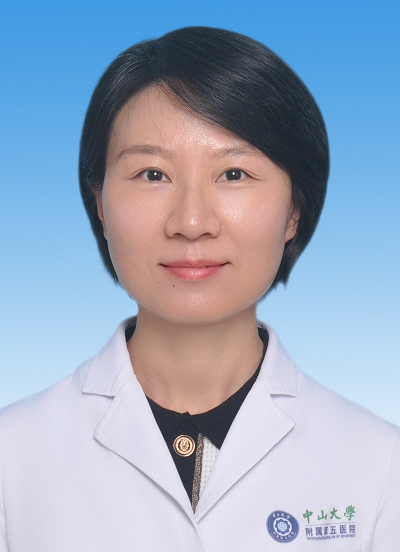

# 温欣

## 基础信息

| 字段 | 内容 |
|---|---|
| 姓名 | 温欣 |
| 医院 | 中山大学附属第五医院 |
| 科室 | 超声医学科 |
| 职称/身份 | 主任医师，医学博士，博士生导师。 |
| 重点优先级 | 高 |
| 来源链接 | https://www.sysu5.cn/medical-service/department-expert/doctor/10850 |
| 采集日期 | 2026-08-08 |

## 简介/擅长

温欣医生来自中山大学附属第五医院超声医学科。
官网擅长线索：擅长甲状腺、乳腺、消化、泌尿等浅表腹部器官疾病的超声诊断。 擅长甲状腺乳腺疾病的常规超声和新技术诊断，对肝胆脾胰肾输尿管膀胱疾病超声诊断有多年临床经验。

## 可包装亮点

- 主任医师，医学博士，博士生导师。
- 中国超声医学工程学会浅表器官及外周血管超声专业委员会委员，中国医药教育协会超声专业委员会常务委员，广东省医学教育协会超声临床教学专业委员会常务委员，广东省医学会超声医学分会青年委员会委员，广东省精准医学应用学会超声医学分会委员，广东省中西…
- 主持科研课题国家级1项、厅局级3项、校级1项，获省医疗新技术成果二等奖、省自然科学学术成果二等奖、省柯麟医学教育基金会临床医学专业优秀教师奖等。

## 重点疾病/人群标签

- 慢性病：
- 肿瘤：
- 生殖疾病：
- 免疫/风湿：
- 术后恢复/康复：
- 疑难重症：

## 证据摘录

> 以下只保留官网公开信息中的短句或关键字段，不复制大段原文。

- 官网身份字段：主任医师，医学博士，博士生导师。
- 官网擅长线索：擅长甲状腺、乳腺、消化、泌尿等浅表腹部器官疾病的超声诊断。 擅长甲状腺乳腺疾病的常规超声和新技术诊断，对肝胆脾胰肾输尿管膀胱疾病超声诊断有多年临床经验。
- 官网经历线索：主任医师，医学博士，博士生导师。 中国超声医学工程学会浅表器官及外周血管超声专业委员会委员，中国医药教育协会超声专业委员会常务委员，广东省医学教育协会超声临床教学专业委员会常务委员，广东省医学会超声医学分会青年委员会委员，广东省精准医学应用学会超声医学分会委员，广东省中西医结合超声医学委员会委员等。 主持科研课题国家…
- 来源链接：https://www.sysu5.cn/medical-service/department-expert/doctor/10850

## BD 画像摘要

温欣医生可作为超声医学科基础医生数据入库。当前官网资料暂未显示与本阶段重点疾病方向的强关联，建议先保留基础画像，后续按官方资料补充复核。

## 合规边界

- 本条画像仅基于医院官网公开医生详情页整理。
- 未采集私人联系方式、患者案例、非公开排班或第三方评价。
- 所有亮点均需保留来源链接，不得改写为治疗效果承诺。
