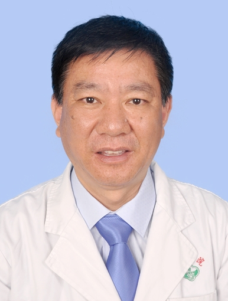

# 温盛霖

## 基础信息

| 字段 | 内容 |
|---|---|
| 姓名 | 温盛霖 |
| 医院 | 中山大学附属第五医院 |
| 科室 | 精神心理科 |
| 职称/身份 | 主任医师，博士生导师，首席专家。 |
| 重点优先级 | 高 |
| 来源链接 | https://www.sysu5.cn/medical-service/department-expert/doctor/10783 |
| 采集日期 | 2026-08-08 |

## 简介/擅长

温盛霖医生来自中山大学附属第五医院精神心理科，官网公开资料显示其诊疗线索与疑难重症相关。
官网擅长线索：擅长：失眠症、强迫症和抑郁症等疾病的诊治。 从事精神心理科临床诊疗工作30余年，对精神心理科常见病的诊治具有丰富经验，熟练掌握心理治疗和心理咨询技巧，尤其擅长失眠症、强迫症和抑郁症等疾病的诊治，对疑难精神心理疾病和心身疾病的也有较深入的研究。

## 可包装亮点

- 主任医师，博士生导师，首席专家。
- 从事精神心理科临床诊疗工作30余年，对精神心理科常见病的诊治具有丰富经验，熟练掌握心理治疗和心理咨询技巧，尤其擅长失眠症、强迫症和抑郁症等疾病的诊治，对疑难精神心理疾病和心身疾病的也有较深入的研究。
- 是中华医学会行为管理分会委员，广东省心理卫生协会常务委员，广东省医学心理评估委员会副主任委员，珠海市医师协会理事。

## 重点疾病/人群标签

- 慢性病：
- 肿瘤：
- 生殖疾病：
- 免疫/风湿：
- 术后恢复/康复：
- 疑难重症：疑难

## 证据摘录

> 以下只保留官网公开信息中的短句或关键字段，不复制大段原文。

- 官网身份字段：主任医师，博士生导师，首席专家。
- 官网擅长线索：擅长：失眠症、强迫症和抑郁症等疾病的诊治。 从事精神心理科临床诊疗工作30余年，对精神心理科常见病的诊治具有丰富经验，熟练掌握心理治疗和心理咨询技巧，尤其擅长失眠症、强迫症和抑郁症等疾病的诊治，对疑难精神心理疾病和心身疾病的也有较深入的研究。
- 官网经历线索：主任医师，博士生导师，首席专家。 从事精神心理科临床诊疗工作30余年，对精神心理科常见病的诊治具有丰富经验，熟练掌握心理治疗和心理咨询技巧，尤其擅长失眠症、强迫症和抑郁症等疾病的诊治，对疑难精神心理疾病和心身疾病的也有较深入的研究。 是中华医学会行为管理分会委员，广东省心理卫生协会常务委员，广东省医学心理评估委员会副…
- 来源链接：https://www.sysu5.cn/medical-service/department-expert/doctor/10783

## BD 画像摘要

温盛霖医生可作为疑难重症方向的医生画像候选。后续 BD 包装应围绕官网已展示的科室、职称、擅长和经历线索展开，保持待人工复核状态，不添加疗效承诺。

## 合规边界

- 本条画像仅基于医院官网公开医生详情页整理。
- 未采集私人联系方式、患者案例、非公开排班或第三方评价。
- 所有亮点均需保留来源链接，不得改写为治疗效果承诺。
