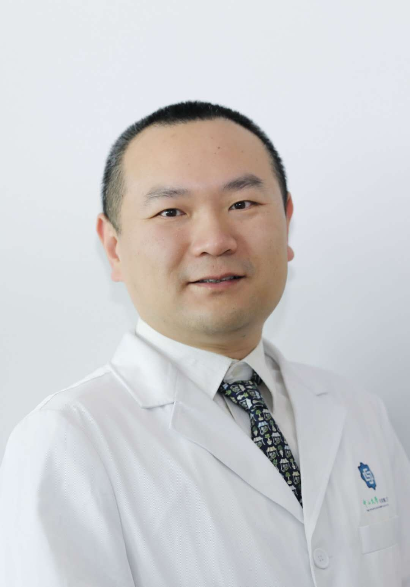

# 牛斌

## 基础信息

| 字段 | 内容 |
|---|---|
| 姓名 | 牛斌 |
| 医院 | 中山大学附属第五医院 |
| 科室 | 胃肠外科 |
| 职称/身份 | 主治医师，医学硕士。 |
| 重点优先级 | 高 |
| 来源链接 | https://www.sysu5.cn/medical-service/department-expert/doctor/2661 |
| 采集日期 | 2026-08-08 |

## 简介/擅长

牛斌医生来自中山大学附属第五医院胃肠外科。
官网擅长线索：开展胃肠常见疾病，尤其是疝、痔、瘘的腹腔镜微创手术治疗，也擅长对普通外科其他常见病的手术治疗，

## 可包装亮点

- 毕业后一直从事外科临床工作20年，广东省医师协会胃肠外科青年委员，参与多项国家和省部级科研课题的研究工作。
- 在国内核心期刊等发表多篇高水平论著。
- 在国内外杂志发表文章10余篇。

## 重点疾病/人群标签

- 慢性病：
- 肿瘤：
- 生殖疾病：
- 免疫/风湿：
- 术后恢复/康复：
- 疑难重症：

## 证据摘录

> 以下只保留官网公开信息中的短句或关键字段，不复制大段原文。

- 官网身份字段：主治医师，医学硕士。
- 官网擅长线索：开展胃肠常见疾病，尤其是疝、痔、瘘的腹腔镜微创手术治疗，也擅长对普通外科其他常见病的手术治疗，
- 官网经历线索：毕业后一直从事外科临床工作20年，广东省医师协会胃肠外科青年委员，参与多项国家和省部级科研课题的研究工作。 在国内核心期刊等发表多篇高水平论著。 在国内外杂志发表文章10余篇。
- 来源链接：https://www.sysu5.cn/medical-service/department-expert/doctor/2661

## BD 画像摘要

牛斌医生可作为胃肠外科基础医生数据入库。当前官网资料暂未显示与本阶段重点疾病方向的强关联，建议先保留基础画像，后续按官方资料补充复核。

## 合规边界

- 本条画像仅基于医院官网公开医生详情页整理。
- 未采集私人联系方式、患者案例、非公开排班或第三方评价。
- 所有亮点均需保留来源链接，不得改写为治疗效果承诺。
