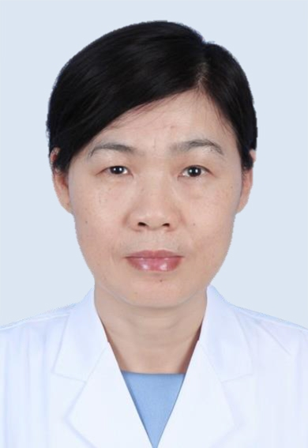

# 王发敏

## 基础信息

| 字段 | 内容 |
|---|---|
| 姓名 | 王发敏 |
| 医院 | 中山大学附属第五医院 |
| 科室 | 超声医学科 |
| 职称/身份 | 副主任医师 |
| 重点优先级 | 高 |
| 来源链接 | https://www.sysu5.cn/medical-service/department-expert/doctor/10849 |
| 采集日期 | 2026-08-08 |

## 简介/擅长

王发敏医生来自中山大学附属第五医院超声医学科，官网公开资料显示其诊疗线索与肿瘤、生殖疾病、疑难重症相关。
官网擅长线索：从事妇产超声诊断工作20余年，擅长妇科常见疾病和疑难病例的超声诊断，包括妇科常规超声，子宫肿瘤、卵巢肿瘤、盆腔炎症的超声诊断； 擅长产前胎儿畸形筛查及超声诊断，包括胎儿早期NT检测、中晚孕期筛查、胎儿畸形的超声诊断，熟悉妇产相关的超声介入及造影。

## 可包装亮点

- 副主任医师 副主任医师 从事妇产超声诊断工作20余年，擅长妇科常见疾病和疑难病例的超声诊断，包括妇科常规超声，子宫肿瘤、卵巢肿瘤、盆腔炎症的超声诊断；

## 重点疾病/人群标签

- 慢性病：
- 肿瘤：肿瘤、瘤
- 生殖疾病：卵巢
- 免疫/风湿：
- 术后恢复/康复：
- 疑难重症：疑难

## 证据摘录

> 以下只保留官网公开信息中的短句或关键字段，不复制大段原文。

- 官网身份字段：副主任医师
- 官网擅长线索：从事妇产超声诊断工作20余年，擅长妇科常见疾病和疑难病例的超声诊断，包括妇科常规超声，子宫肿瘤、卵巢肿瘤、盆腔炎症的超声诊断； 擅长产前胎儿畸形筛查及超声诊断，包括胎儿早期NT检测、中晚孕期筛查、胎儿畸形的超声诊断，熟悉妇产相关的超声介入及造影。
- 官网经历线索：副主任医师 副主任医师 从事妇产超声诊断工作20余年，擅长妇科常见疾病和疑难病例的超声诊断，包括妇科常规超声，子宫肿瘤、卵巢肿瘤、盆腔炎症的超声诊断；
- 来源链接：https://www.sysu5.cn/medical-service/department-expert/doctor/10849

## BD 画像摘要

王发敏医生可作为肿瘤、生殖疾病、疑难重症方向的医生画像候选。后续 BD 包装应围绕官网已展示的科室、职称、擅长和经历线索展开，保持待人工复核状态，不添加疗效承诺。

## 合规边界

- 本条画像仅基于医院官网公开医生详情页整理。
- 未采集私人联系方式、患者案例、非公开排班或第三方评价。
- 所有亮点均需保留来源链接，不得改写为治疗效果承诺。
