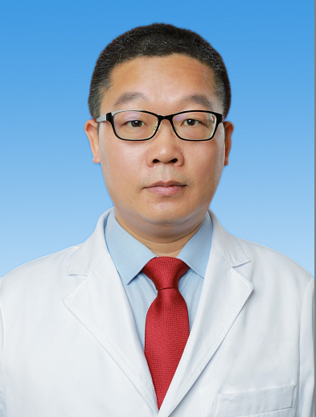

# 王晓进

## 基础信息

| 字段 | 内容 |
|---|---|
| 姓名 | 王晓进 |
| 医院 | 中山大学附属第五医院 |
| 科室 | 胸外科 |
| 职称/身份 | 副主任医师，医学博士。 |
| 重点优先级 | 高 |
| 来源链接 | https://www.sysu5.cn/medical-service/department-expert/doctor/6651 |
| 采集日期 | 2026-08-08 |

## 简介/擅长

王晓进医生来自中山大学附属第五医院胸外科，官网公开资料显示其诊疗线索与肿瘤、术后恢复/康复、疑难重症相关。
官网擅长线索：擅长：肺癌、食管癌、纵隔肿瘤、漏斗胸、气胸、手汗症诊断及治疗。 本科毕业于华中科技大学，硕博士毕业于中山大学，从事胸外科工作20余年，擅长肺癌、食管癌、纵隔肿瘤、漏斗胸、胸腔积液、气胸、手足多汗症、胸部创伤的微创手术治疗。 特别是在肺结节的良恶性鉴别诊断和中晚期肺癌、食管癌的转化治疗评估方面，积累了丰富的临床经验，准确把握手术治疗时机，提高手术完整切除率，降低术后并发症。

## 可包装亮点

- 副主任医师，医学博士。
- 现担任广东省医疗行业协会肺部肿瘤分会常务委员、广东省医疗行业协会肺部肿瘤分会常务委员、广东省胸部疾病学会胸壁外科专业委员会委员、珠海市医师协会胸外科分会常务委员、珠海市抗癌协会胸部肿瘤危重症专业委员会常务委员。
- 作为骨干参加省部级临床注册研究（中山大学5010研究）1项，国家重大研发计划1项、主持珠海市科创局立项研究2项，相应研究成果在The Annals of Thoracic Surgery、surgical endoscopy、Journa…

## 重点疾病/人群标签

- 慢性病：
- 肿瘤：肿瘤、癌、瘤、肺癌
- 生殖疾病：
- 免疫/风湿：
- 术后恢复/康复：术后
- 疑难重症：危重、重症、转化治疗

## 证据摘录

> 以下只保留官网公开信息中的短句或关键字段，不复制大段原文。

- 官网身份字段：副主任医师，医学博士。
- 官网擅长线索：擅长：肺癌、食管癌、纵隔肿瘤、漏斗胸、气胸、手汗症诊断及治疗。 本科毕业于华中科技大学，硕博士毕业于中山大学，从事胸外科工作20余年，擅长肺癌、食管癌、纵隔肿瘤、漏斗胸、胸腔积液、气胸、手足多汗症、胸部创伤的微创手术治疗。 特别是在肺结节的良恶性鉴别诊断和中晚期肺癌、食管癌的转化治疗评估方面，积累了丰富的临床经验，准…
- 官网经历线索：副主任医师，医学博士。 现担任广东省医疗行业协会肺部肿瘤分会常务委员、广东省医疗行业协会肺部肿瘤分会常务委员、广东省胸部疾病学会胸壁外科专业委员会委员、珠海市医师协会胸外科分会常务委员、珠海市抗癌协会胸部肿瘤危重症专业委员会常务委员。 作为骨干参加省部级临床注册研究（中山大学5010研究）1项，国家重大研发计划1项…
- 来源链接：https://www.sysu5.cn/medical-service/department-expert/doctor/6651

## BD 画像摘要

王晓进医生可作为肿瘤、术后恢复/康复、疑难重症方向的医生画像候选。后续 BD 包装应围绕官网已展示的科室、职称、擅长和经历线索展开，保持待人工复核状态，不添加疗效承诺。

## 合规边界

- 本条画像仅基于医院官网公开医生详情页整理。
- 未采集私人联系方式、患者案例、非公开排班或第三方评价。
- 所有亮点均需保留来源链接，不得改写为治疗效果承诺。
