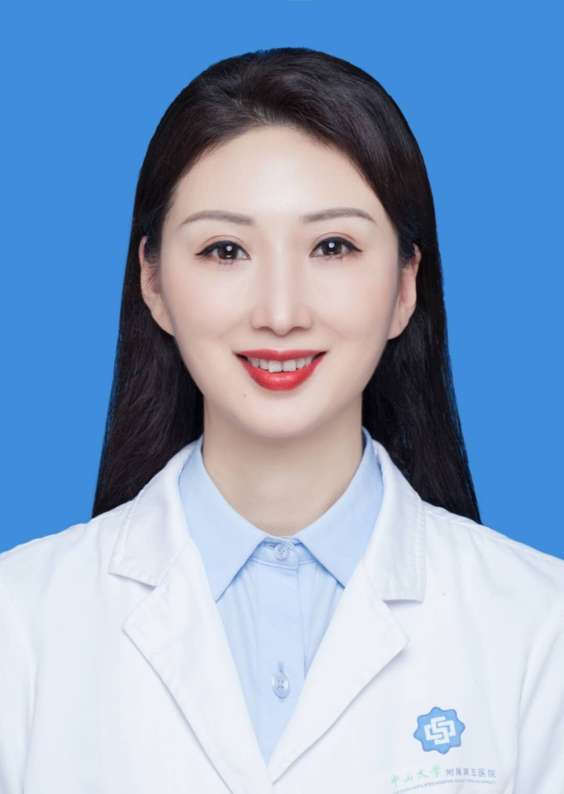

# 申雪

## 基础信息

| 字段 | 内容 |
|---|---|
| 姓名 | 申雪 |
| 医院 | 中山大学附属第五医院 |
| 科室 | 创面修复与烧伤外科 |
| 职称/身份 | 主治医师。 |
| 重点优先级 | 高 |
| 来源链接 | https://www.sysu5.cn/medical-service/department-expert/doctor/9093 |
| 采集日期 | 2026-08-08 |

## 简介/擅长

申雪医生来自中山大学附属第五医院创面修复与烧伤外科，官网公开资料显示其诊疗线索与术后恢复/康复相关。
官网擅长线索：美容主诊医师，2002年毕业于哈尔滨医科大学、大学本科，从事整形美容外科的临床工作十余年，多次到台湾、韩国、日本等整形美容外科机构参观学习，紧跟时代步伐，擅长各种面部精细微雕线雕与面部年轻化。 面部整形美容：改变脸型、鼻综合整形、面部外伤美容缝合、面部抗瘢痕治疗等。

## 可包装亮点

- 华南医学美容专家委员会委员、广东省医师协会整形美容分会委员、广东中西医结合整形美容抗衰老分会青年委员

## 重点疾病/人群标签

- 慢性病：
- 肿瘤：
- 生殖疾病：
- 免疫/风湿：
- 术后恢复/康复：创面、烧伤
- 疑难重症：

## 证据摘录

> 以下只保留官网公开信息中的短句或关键字段，不复制大段原文。

- 官网身份字段：主治医师。
- 官网擅长线索：美容主诊医师，2002年毕业于哈尔滨医科大学、大学本科，从事整形美容外科的临床工作十余年，多次到台湾、韩国、日本等整形美容外科机构参观学习，紧跟时代步伐，擅长各种面部精细微雕线雕与面部年轻化。 面部整形美容：改变脸型、鼻综合整形、面部外伤美容缝合、面部抗瘢痕治疗等。
- 官网经历线索：华南医学美容专家委员会委员、广东省医师协会整形美容分会委员、广东中西医结合整形美容抗衰老分会青年委员
- 来源链接：https://www.sysu5.cn/medical-service/department-expert/doctor/9093

## BD 画像摘要

申雪医生可作为术后恢复/康复方向的医生画像候选。后续 BD 包装应围绕官网已展示的科室、职称、擅长和经历线索展开，保持待人工复核状态，不添加疗效承诺。

## 合规边界

- 本条画像仅基于医院官网公开医生详情页整理。
- 未采集私人联系方式、患者案例、非公开排班或第三方评价。
- 所有亮点均需保留来源链接，不得改写为治疗效果承诺。
