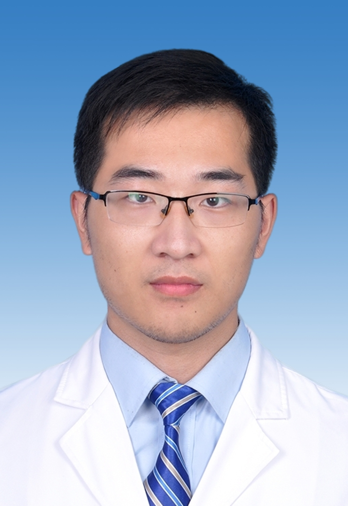

# 矫健

## 基础信息

| 字段 | 内容 |
|---|---|
| 姓名 | 矫健 |
| 医院 | 中山大学附属第五医院 |
| 科室 | 脑血管病中心 |
| 职称/身份 | 主治医师，医学硕士。 |
| 重点优先级 | 中 |
| 来源链接 | https://www.sysu5.cn/medical-service/department-expert/doctor/13141 |
| 采集日期 | 2026-08-08 |

## 简介/擅长

矫健医生来自中山大学附属第五医院脑血管病中心。
官网擅长线索：擅长：脑血管病（脑出血、脑缺血）相关的药物和介入治疗。 本科毕业于吉林大学白求恩医学院，硕士毕业于清华大学临床医学院，于北京清华长庚医院、北京朝阳医院、北京积水潭医院完成外科住院医师规范化培训，2020年硕士毕业后入职神经介入科，从事脑血管病介入治疗，

## 可包装亮点

## 重点疾病/人群标签

- 慢性病：
- 肿瘤：
- 生殖疾病：
- 免疫/风湿：
- 术后恢复/康复：
- 疑难重症：

## 证据摘录

> 以下只保留官网公开信息中的短句或关键字段，不复制大段原文。

- 官网身份字段：主治医师，医学硕士。
- 官网擅长线索：擅长：脑血管病（脑出血、脑缺血）相关的药物和介入治疗。 本科毕业于吉林大学白求恩医学院，硕士毕业于清华大学临床医学院，于北京清华长庚医院、北京朝阳医院、北京积水潭医院完成外科住院医师规范化培训，2020年硕士毕业后入职神经介入科，从事脑血管病介入治疗，
- 来源链接：https://www.sysu5.cn/medical-service/department-expert/doctor/13141

## BD 画像摘要

矫健医生可作为脑血管病中心基础医生数据入库。当前官网资料暂未显示与本阶段重点疾病方向的强关联，建议先保留基础画像，后续按官方资料补充复核。

## 合规边界

- 本条画像仅基于医院官网公开医生详情页整理。
- 未采集私人联系方式、患者案例、非公开排班或第三方评价。
- 所有亮点均需保留来源链接，不得改写为治疗效果承诺。
