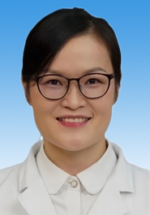

# 米姣平

## 基础信息

| 字段 | 内容 |
|---|---|
| 姓名 | 米姣平 |
| 医院 | 中山大学附属第五医院 |
| 科室 | 耳鼻咽喉&头颈外科 |
| 职称/身份 | 副主任医师，医学硕士。 |
| 重点优先级 | 高 |
| 来源链接 | https://www.sysu5.cn/medical-service/department-expert/doctor/10714 |
| 采集日期 | 2026-08-08 |

## 简介/擅长

米姣平医生来自中山大学附属第五医院耳鼻咽喉&头颈外科，官网公开资料显示其诊疗线索与慢性病、肿瘤、免疫/风湿/感染、术后恢复/康复相关。
官网擅长线索：擅长咽喉相关疾病，鼾症，腺样体肥大腺疾病，鼻窦炎，中耳炎等疾病的诊治。 尤其对嗓音相关疾病，咽喉反流性疾病，腺样体肥大，鼾症，甲状旁腺疾病诊治具有丰富的临床经验。 擅长喉显微外科手术。 具体包括：成人睡眠呼吸障碍疾病的评估、鼾症患者个体化治疗；

## 可包装亮点

- 副主任医师，医学硕士。
- 于2014年先后在中山大学附属第一医院，广东省人民医院进修学习，2017年北京同仁医院进修学习。
- 现任广东省医师协会青年委员会委员，广东省中西医结合耳鼻咽喉科学会委员，广东省抗癌协会委员，广东省吞咽康复学会委员，珠海市医学会秘书。

## 重点疾病/人群标签

- 慢性病：慢性
- 肿瘤：肿瘤、癌、瘤、放疗、鼻咽癌
- 生殖疾病：
- 免疫/风湿：免疫
- 术后恢复/康复：康复
- 疑难重症：

## 证据摘录

> 以下只保留官网公开信息中的短句或关键字段，不复制大段原文。

- 官网身份字段：副主任医师，医学硕士。
- 官网擅长线索：擅长咽喉相关疾病，鼾症，腺样体肥大腺疾病，鼻窦炎，中耳炎等疾病的诊治。 尤其对嗓音相关疾病，咽喉反流性疾病，腺样体肥大，鼾症，甲状旁腺疾病诊治具有丰富的临床经验。 擅长喉显微外科手术。 具体包括：成人睡眠呼吸障碍疾病的评估、鼾症患者个体化治疗；
- 官网经历线索：副主任医师，医学硕士。 于2014年先后在中山大学附属第一医院，广东省人民医院进修学习，2017年北京同仁医院进修学习。 现任广东省医师协会青年委员会委员，广东省中西医结合耳鼻咽喉科学会委员，广东省抗癌协会委员，广东省吞咽康复学会委员，珠海市医学会秘书。
- 来源链接：https://www.sysu5.cn/medical-service/department-expert/doctor/10714

## BD 画像摘要

米姣平医生可作为慢性病、肿瘤、免疫/风湿/感染、术后恢复/康复方向的医生画像候选。后续 BD 包装应围绕官网已展示的科室、职称、擅长和经历线索展开，保持待人工复核状态，不添加疗效承诺。

## 合规边界

- 本条画像仅基于医院官网公开医生详情页整理。
- 未采集私人联系方式、患者案例、非公开排班或第三方评价。
- 所有亮点均需保留来源链接，不得改写为治疗效果承诺。
