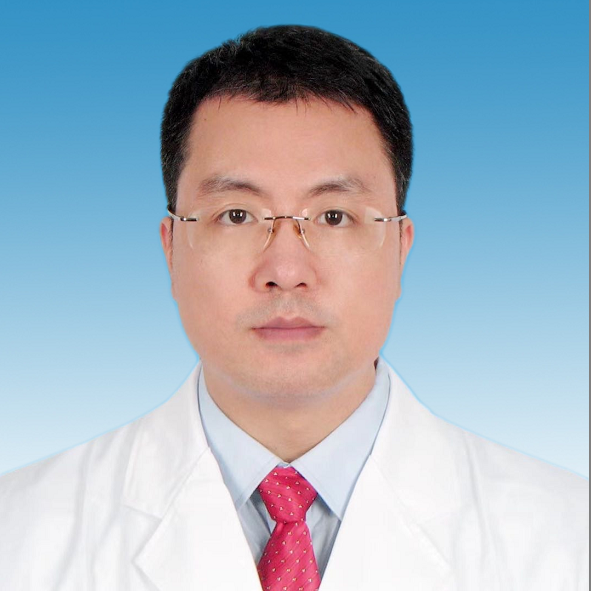

# 聂惠龙

## 基础信息

| 字段 | 内容 |
|---|---|
| 姓名 | 聂惠龙 |
| 医院 | 中山大学附属第五医院 |
| 科室 | 妇科 |
| 职称/身份 | 妇科主任，主任医师，医学博士，博士生导师，博士后合作导师，妇科肿瘤首席专家，妇科四级腔镜技术培训基地负责人。 |
| 重点优先级 | 高 |
| 来源链接 | https://www.sysu5.cn/medical-service/department-expert/doctor/9095 |
| 采集日期 | 2026-08-08 |

## 简介/擅长

聂惠龙医生来自中山大学附属第五医院妇科，官网公开资料显示其诊疗线索与肿瘤、生殖疾病、疑难重症相关。
官网擅长线索：擅长：妇科肿瘤、盆底疾病、宫颈疾病、内分泌月经病的诊治。 中山大学临床医疗系毕业，妇科疑难危重疾病诊治经验丰富，擅长妇科良恶性肿瘤（宫颈癌、内膜癌、卵巢癌以及肌瘤、囊肿等）、盆底疾病（包括子宫脱垂、阴道壁脱垂和尿失禁等）、内分泌月经病的规范化诊治。 常规开展宫腔镜、经脐单孔腹腔镜、阴式单孔腹腔镜、3D腹腔镜、机器人手术辅助腹腔镜等各类妇科无创、微创手术、阴式手术和开腹手术，以及肿瘤根治术和复杂高难度妇科手术。

## 可包装亮点

- 妇科主任，主任医师，医学博士，博士生导师，博士后合作导师，妇科肿瘤首席专家，妇科四级腔镜技术培训基地负责人。
- 中山大学临床医疗系毕业，妇科疑难危重疾病诊治经验丰富，擅长妇科良恶性肿瘤（宫颈癌、内膜癌、卵巢癌以及肌瘤、囊肿等）、盆底疾病（包括子宫脱垂、阴道壁脱垂和尿失禁等）、内分泌月经病的规范化诊治。
- 在医疗卫生行业中担任国家级协会委员和广东省医师协会副主委等十余个协会职务。

## 重点疾病/人群标签

- 慢性病：
- 肿瘤：肿瘤、癌、瘤
- 生殖疾病：卵巢、月经
- 免疫/风湿：
- 术后恢复/康复：
- 疑难重症：疑难、危重、复杂

## 证据摘录

> 以下只保留官网公开信息中的短句或关键字段，不复制大段原文。

- 官网身份字段：妇科主任，主任医师，医学博士，博士生导师，博士后合作导师，妇科肿瘤首席专家，妇科四级腔镜技术培训基地负责人。
- 官网擅长线索：擅长：妇科肿瘤、盆底疾病、宫颈疾病、内分泌月经病的诊治。 中山大学临床医疗系毕业，妇科疑难危重疾病诊治经验丰富，擅长妇科良恶性肿瘤（宫颈癌、内膜癌、卵巢癌以及肌瘤、囊肿等）、盆底疾病（包括子宫脱垂、阴道壁脱垂和尿失禁等）、内分泌月经病的规范化诊治。 常规开展宫腔镜、经脐单孔腹腔镜、阴式单孔腹腔镜、3D腹腔镜、机器人手…
- 官网经历线索：妇科主任，主任医师，医学博士，博士生导师，博士后合作导师，妇科肿瘤首席专家，妇科四级腔镜技术培训基地负责人。 中山大学临床医疗系毕业，妇科疑难危重疾病诊治经验丰富，擅长妇科良恶性肿瘤（宫颈癌、内膜癌、卵巢癌以及肌瘤、囊肿等）、盆底疾病（包括子宫脱垂、阴道壁脱垂和尿失禁等）、内分泌月经病的规范化诊治。 在医疗卫生行业中…
- 来源链接：https://www.sysu5.cn/medical-service/department-expert/doctor/9095

## BD 画像摘要

聂惠龙医生可作为肿瘤、生殖疾病、疑难重症方向的医生画像候选。后续 BD 包装应围绕官网已展示的科室、职称、擅长和经历线索展开，保持待人工复核状态，不添加疗效承诺。

## 合规边界

- 本条画像仅基于医院官网公开医生详情页整理。
- 未采集私人联系方式、患者案例、非公开排班或第三方评价。
- 所有亮点均需保留来源链接，不得改写为治疗效果承诺。
