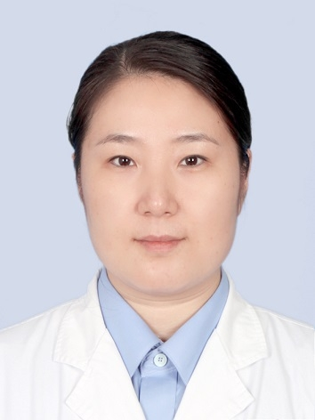

# 肖佐环

## 基础信息

| 字段 | 内容 |
|---|---|
| 姓名 | 肖佐环 |
| 医院 | 中山大学附属第五医院 |
| 科室 | 皮肤科 |
| 职称/身份 | 副主任医师，医学硕士。 |
| 重点优先级 | 高 |
| 来源链接 | https://www.sysu5.cn/medical-service/department-expert/doctor/10760 |
| 采集日期 | 2026-08-08 |

## 简介/擅长

肖佐环医生来自中山大学附属第五医院皮肤科，官网公开资料显示其诊疗线索与免疫/风湿/感染相关。
官网擅长线索：从事皮肤性病科临床工作近30年，临床工作经验丰富，擅长治疗痤疮、白癜风、脱发、面部皮炎、脂溢性皮炎、酒渣鼻、湿疹、荨麻疹、尖锐湿疣及其他感染性皮肤病、血管性皮肤病、色素性皮肤病、性传播疾病等。

## 可包装亮点

- 副主任医师，医学硕士。
- 现任广东省整形美容协会皮肤美容分会委员，广东省中西医结合学会医学美容专业委员会委员，广东省医学会皮肤性病学分会银屑病学组委员，珠海市医师协会皮肤性病分会副主委，珠海市医学会皮肤性病学分副主委。
- 在《中华皮肤科杂志》等国家级杂志发表论文30余篇；

## 重点疾病/人群标签

- 慢性病：
- 肿瘤：
- 生殖疾病：
- 免疫/风湿：感染
- 术后恢复/康复：
- 疑难重症：

## 证据摘录

> 以下只保留官网公开信息中的短句或关键字段，不复制大段原文。

- 官网身份字段：副主任医师，医学硕士。
- 官网擅长线索：从事皮肤性病科临床工作近30年，临床工作经验丰富，擅长治疗痤疮、白癜风、脱发、面部皮炎、脂溢性皮炎、酒渣鼻、湿疹、荨麻疹、尖锐湿疣及其他感染性皮肤病、血管性皮肤病、色素性皮肤病、性传播疾病等。
- 官网经历线索：副主任医师，医学硕士。 现任广东省整形美容协会皮肤美容分会委员，广东省中西医结合学会医学美容专业委员会委员，广东省医学会皮肤性病学分会银屑病学组委员，珠海市医师协会皮肤性病分会副主委，珠海市医学会皮肤性病学分副主委。 在《中华皮肤科杂志》等国家级杂志发表论文30余篇；
- 来源链接：https://www.sysu5.cn/medical-service/department-expert/doctor/10760

## BD 画像摘要

肖佐环医生可作为免疫/风湿/感染方向的医生画像候选。后续 BD 包装应围绕官网已展示的科室、职称、擅长和经历线索展开，保持待人工复核状态，不添加疗效承诺。

## 合规边界

- 本条画像仅基于医院官网公开医生详情页整理。
- 未采集私人联系方式、患者案例、非公开排班或第三方评价。
- 所有亮点均需保留来源链接，不得改写为治疗效果承诺。
