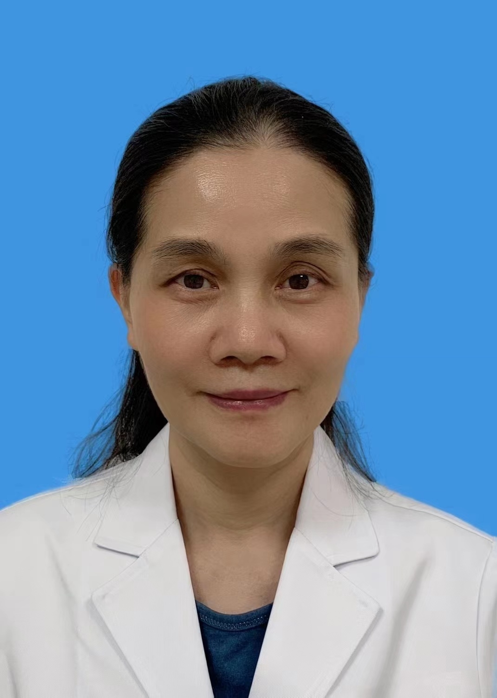

# 胡晓艳

## 基础信息

| 字段 | 内容 |
|---|---|
| 姓名 | 胡晓艳 |
| 医院 | 中山大学附属第五医院 |
| 科室 | 皮肤科 |
| 职称/身份 | 副主任医师，医学硕士。 |
| 重点优先级 | 高 |
| 来源链接 | https://www.sysu5.cn/medical-service/department-expert/doctor/10759 |
| 采集日期 | 2026-08-08 |

## 简介/擅长

胡晓艳医生来自中山大学附属第五医院皮肤科，官网公开资料显示其诊疗线索与肿瘤、免疫/风湿/感染相关。
官网擅长线索：擅长诊治疱疹、梅毒、尖锐湿疣、外阴溃疡、皮肤真菌病、皮肤肿瘤，皮肤瘙痒、激光美容、化妆品皮炎，白癜风、黄褐斑、痤疮、酒渣鼻、脱发、瘢痕、湿疹、荨麻疹、银屑病、天疱疮、皮肌炎、红斑狼疮。

## 可包装亮点

- 副主任医师，医学硕士。
- 湖北中医药大学，1989年学士，中山大学2008年医学硕士，先后在中国协和医科大学南京皮肤病研究所美容皮肤病研修班、上海复旦大学附属华山医院皮肤病理研修班学习。
- 现任广东省医学会激光医学分会委员、广东省医学会皮肤性病学分会真菌学组成员，珠海市医学会皮肤性病学分会常委，珠海市医学会变态反应学分会常委。

## 重点疾病/人群标签

- 慢性病：
- 肿瘤：肿瘤、瘤
- 生殖疾病：
- 免疫/风湿：红斑狼疮
- 术后恢复/康复：
- 疑难重症：

## 证据摘录

> 以下只保留官网公开信息中的短句或关键字段，不复制大段原文。

- 官网身份字段：副主任医师，医学硕士。
- 官网擅长线索：擅长诊治疱疹、梅毒、尖锐湿疣、外阴溃疡、皮肤真菌病、皮肤肿瘤，皮肤瘙痒、激光美容、化妆品皮炎，白癜风、黄褐斑、痤疮、酒渣鼻、脱发、瘢痕、湿疹、荨麻疹、银屑病、天疱疮、皮肌炎、红斑狼疮。
- 官网经历线索：副主任医师，医学硕士。 湖北中医药大学，1989年学士，中山大学2008年医学硕士，先后在中国协和医科大学南京皮肤病研究所美容皮肤病研修班、上海复旦大学附属华山医院皮肤病理研修班学习。 现任广东省医学会激光医学分会委员、广东省医学会皮肤性病学分会真菌学组成员，珠海市医学会皮肤性病学分会常委，珠海市医学会变态反应学分会…
- 来源链接：https://www.sysu5.cn/medical-service/department-expert/doctor/10759

## BD 画像摘要

胡晓艳医生可作为肿瘤、免疫/风湿/感染方向的医生画像候选。后续 BD 包装应围绕官网已展示的科室、职称、擅长和经历线索展开，保持待人工复核状态，不添加疗效承诺。

## 合规边界

- 本条画像仅基于医院官网公开医生详情页整理。
- 未采集私人联系方式、患者案例、非公开排班或第三方评价。
- 所有亮点均需保留来源链接，不得改写为治疗效果承诺。
