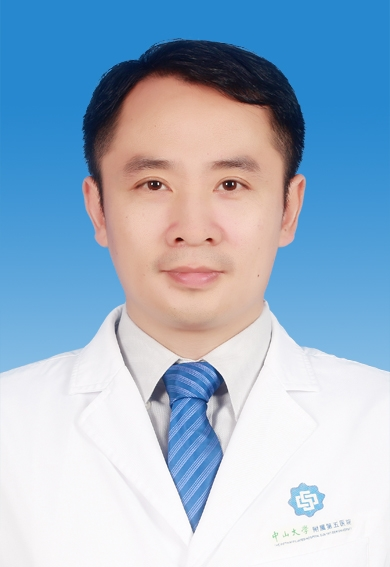

# 苏永辉

## 基础信息

| 字段 | 内容 |
|---|---|
| 姓名 | 苏永辉 |
| 医院 | 中山大学附属第五医院 |
| 科室 | 胃肠外科 |
| 职称/身份 | 胃肠外科副主任，主任医师，医学博士，博士生导师。 |
| 重点优先级 | 高 |
| 来源链接 | https://www.sysu5.cn/medical-service/department-expert/doctor/2563 |
| 采集日期 | 2026-08-08 |

## 简介/擅长

苏永辉医生来自中山大学附属第五医院胃肠外科，官网公开资料显示其诊疗线索与慢性病、肿瘤相关。
官网擅长线索：擅长：胃癌、结直肠癌、腹壁疝及肛肠疾病的规范化治疗，尤其擅长以微创技术治疗消化道肿瘤及腹壁疝。 专业特长：擅长胃癌、结肠癌、直肠癌、腹壁疝及肛肠疾病的规范化治疗，尤其擅长以微创技术治疗消化道肿瘤及腹壁疝，能熟练完成腹腔镜下胃癌根治术、腹腔镜结直肠癌手术，对TME手术、保留自主神经的侧方淋巴结清扫术、超低位直肠癌的保肛手术以及保留迷走神经的胃癌根治术等新术式均有深入研究。 开展微创胃肠减重手术（胃旁路术、袖状胃切除术）治疗肥胖症及2型糖尿病。

## 可包装亮点

- 胃肠外科副主任，主任医师，医学博士，博士生导师。
- 2002年毕业于中山大学临床医学系， 2011年取得中山大学普通外科学博士学位， 2018年在美国Stanford University访学1年。
- 目前为广东省医师协会胃肠外科医师分会常务委员、广东省医学会外科分会委员、广东省医师协会疝和腹壁外科医师分会委员珠海市医师协会普通外科医师分会副主任委员、珠海市医师协会微创外科医师分会副主任委员、喀什地区医院协会代谢与疝外科委员会名誉主委。

## 重点疾病/人群标签

- 慢性病：糖尿病、代谢
- 肿瘤：肿瘤、癌、瘤、胃癌、肠癌
- 生殖疾病：
- 免疫/风湿：
- 术后恢复/康复：
- 疑难重症：

## 证据摘录

> 以下只保留官网公开信息中的短句或关键字段，不复制大段原文。

- 官网身份字段：胃肠外科副主任，主任医师，医学博士，博士生导师。
- 官网擅长线索：擅长：胃癌、结直肠癌、腹壁疝及肛肠疾病的规范化治疗，尤其擅长以微创技术治疗消化道肿瘤及腹壁疝。 专业特长：擅长胃癌、结肠癌、直肠癌、腹壁疝及肛肠疾病的规范化治疗，尤其擅长以微创技术治疗消化道肿瘤及腹壁疝，能熟练完成腹腔镜下胃癌根治术、腹腔镜结直肠癌手术，对TME手术、保留自主神经的侧方淋巴结清扫术、超低位直肠癌的保肛…
- 官网经历线索：胃肠外科副主任，主任医师，医学博士，博士生导师。 2002年毕业于中山大学临床医学系， 2011年取得中山大学普通外科学博士学位， 2018年在美国Stanford University访学1年。 目前为广东省医师协会胃肠外科医师分会常务委员、广东省医学会外科分会委员、广东省医师协会疝和腹壁外科医师分会委员珠海市医师…
- 来源链接：https://www.sysu5.cn/medical-service/department-expert/doctor/2563

## BD 画像摘要

苏永辉医生可作为慢性病、肿瘤方向的医生画像候选。后续 BD 包装应围绕官网已展示的科室、职称、擅长和经历线索展开，保持待人工复核状态，不添加疗效承诺。

## 合规边界

- 本条画像仅基于医院官网公开医生详情页整理。
- 未采集私人联系方式、患者案例、非公开排班或第三方评价。
- 所有亮点均需保留来源链接，不得改写为治疗效果承诺。
