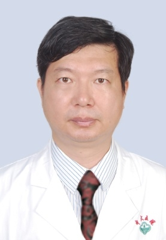

# 范翔

## 基础信息

| 字段 | 内容 |
|---|---|
| 姓名 | 范翔 |
| 医院 | 中山大学附属第五医院 |
| 科室 | 神经外科 |
| 职称/身份 | 神经外科副主任，副主任医师，医学博士，硕士生导师。 |
| 重点优先级 | 高 |
| 来源链接 | https://www.sysu5.cn/medical-service/department-expert/doctor/8481 |
| 采集日期 | 2026-08-08 |

## 简介/擅长

范翔医生来自中山大学附属第五医院神经外科，官网公开资料显示其诊疗线索与肿瘤相关。
官网擅长线索：1993年白求恩医科大学本科毕业，2013年中山大学附属第一医院神经外科博士毕业，现任广东省基层医药学会神经外科专业委员会副主任委员，广东省健康管理学会脑血管病防治和健康促进专业委员会副主任委员，中国医药教育协会神经内镜与微创医学专业委员会委员，广东省医师协会神经外科分会第四届常务委员，广州市抗癌协会神经肿瘤分组常委… 擅长颅脑肿瘤的显微外科治疗和垂体腺瘤的综合治疗，以及脑外伤、脑出血的微创治疗，神经外科常见疾病的规范化治疗。

## 可包装亮点

- 神经外科副主任，副主任医师，医学博士，硕士生导师。
- 1993年白求恩医科大学本科毕业，2013年中山大学附属第一医院神经外科博士毕业，现任广东省基层医药学会神经外科专业委员会副主任委员，广东省健康管理学会脑血管病防治和健康促进专业委员会副主任委员，中国医药教育协会神经内镜与微创医学专业委员…

## 重点疾病/人群标签

- 慢性病：
- 肿瘤：肿瘤、癌、瘤
- 生殖疾病：
- 免疫/风湿：
- 术后恢复/康复：
- 疑难重症：

## 证据摘录

> 以下只保留官网公开信息中的短句或关键字段，不复制大段原文。

- 官网身份字段：神经外科副主任，副主任医师，医学博士，硕士生导师。
- 官网擅长线索：1993年白求恩医科大学本科毕业，2013年中山大学附属第一医院神经外科博士毕业，现任广东省基层医药学会神经外科专业委员会副主任委员，广东省健康管理学会脑血管病防治和健康促进专业委员会副主任委员，中国医药教育协会神经内镜与微创医学专业委员会委员，广东省医师协会神经外科分会第四届常务委员，广州市抗癌协会神经肿瘤分组常委…
- 官网经历线索：神经外科副主任，副主任医师，医学博士，硕士生导师。 1993年白求恩医科大学本科毕业，2013年中山大学附属第一医院神经外科博士毕业，现任广东省基层医药学会神经外科专业委员会副主任委员，广东省健康管理学会脑血管病防治和健康促进专业委员会副主任委员，中国医药教育协会神经内镜与微创医学专业委员会委员，广东省医师协会神经外…
- 来源链接：https://www.sysu5.cn/medical-service/department-expert/doctor/8481

## BD 画像摘要

范翔医生可作为肿瘤方向的医生画像候选。后续 BD 包装应围绕官网已展示的科室、职称、擅长和经历线索展开，保持待人工复核状态，不添加疗效承诺。

## 合规边界

- 本条画像仅基于医院官网公开医生详情页整理。
- 未采集私人联系方式、患者案例、非公开排班或第三方评价。
- 所有亮点均需保留来源链接，不得改写为治疗效果承诺。
