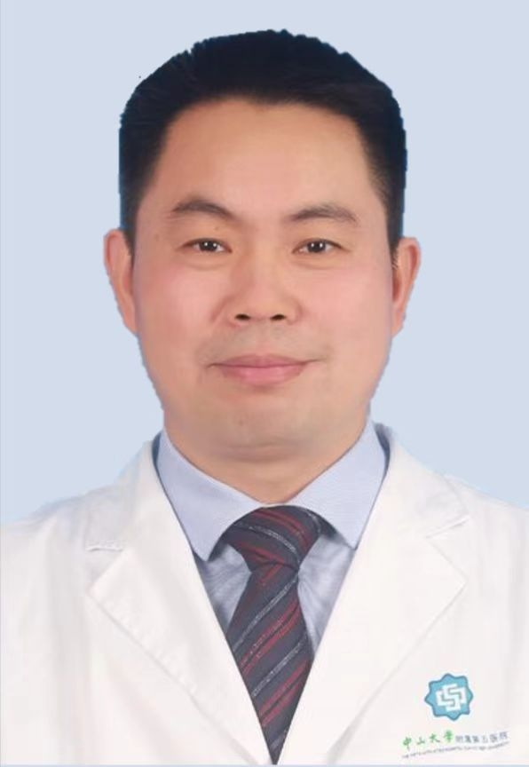

# 蔡喜雨

## 基础信息

| 字段 | 内容 |
|---|---|
| 姓名 | 蔡喜雨 |
| 医院 | 中山大学附属第五医院 |
| 科室 | 创伤与关节外科 |
| 职称/身份 | 创伤与关节外科副主任，副主任医师，医学博士，硕士生导师，骨科住培基地教学主任。 |
| 重点优先级 | 高 |
| 来源链接 | https://www.sysu5.cn/medical-service/department-expert/doctor/8064 |
| 采集日期 | 2026-08-08 |

## 简介/擅长

蔡喜雨医生来自中山大学附属第五医院创伤与关节外科，官网公开资料显示其诊疗线索与慢性病、术后恢复/康复相关。
官网擅长线索：擅长：股骨头坏死、骨关节炎、骨折脱位、韧带损伤、四肢畸形。 擅长骨科微创技术与显微外科技术。 如股骨头坏死的吻合血管腓骨移植“保头”治疗和全髋置换；

## 可包装亮点

- 创伤与关节外科副主任，副主任医师，医学博士，硕士生导师，骨科住培基地教学主任。
- 中华医学会工程学分会数字骨科学组委员，中国医师协会显微外科医师分会骨缺损学组委员，中国康复医学会修复重建外科专业委员会委员、皮瓣学组委员，中国研究型医院学会骨科创新与转化分会常委、外固定学组副主任委员，中南六省手外科学会委员，中国医疗保健…

## 重点疾病/人群标签

- 慢性病：糖尿病
- 肿瘤：
- 生殖疾病：
- 免疫/风湿：
- 术后恢复/康复：康复、创面
- 疑难重症：

## 证据摘录

> 以下只保留官网公开信息中的短句或关键字段，不复制大段原文。

- 官网身份字段：创伤与关节外科副主任，副主任医师，医学博士，硕士生导师，骨科住培基地教学主任。
- 官网擅长线索：擅长：股骨头坏死、骨关节炎、骨折脱位、韧带损伤、四肢畸形。 擅长骨科微创技术与显微外科技术。 如股骨头坏死的吻合血管腓骨移植“保头”治疗和全髋置换；
- 官网经历线索：创伤与关节外科副主任，副主任医师，医学博士，硕士生导师，骨科住培基地教学主任。 中华医学会工程学分会数字骨科学组委员，中国医师协会显微外科医师分会骨缺损学组委员，中国康复医学会修复重建外科专业委员会委员、皮瓣学组委员，中国研究型医院学会骨科创新与转化分会常委、外固定学组副主任委员，中南六省手外科学会委员，中国医疗保健…
- 来源链接：https://www.sysu5.cn/medical-service/department-expert/doctor/8064

## BD 画像摘要

蔡喜雨医生可作为慢性病、术后恢复/康复方向的医生画像候选。后续 BD 包装应围绕官网已展示的科室、职称、擅长和经历线索展开，保持待人工复核状态，不添加疗效承诺。

## 合规边界

- 本条画像仅基于医院官网公开医生详情页整理。
- 未采集私人联系方式、患者案例、非公开排班或第三方评价。
- 所有亮点均需保留来源链接，不得改写为治疗效果承诺。
