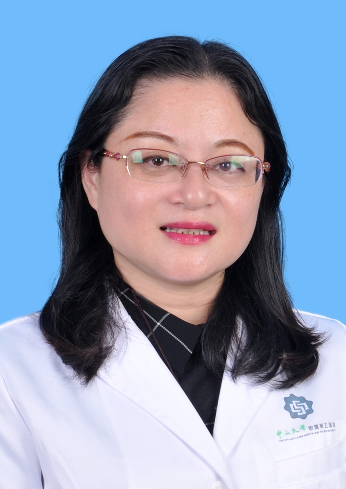

# 薛青

## 基础信息

| 字段 | 内容 |
|---|---|
| 姓名 | 薛青 |
| 医院 | 中山大学附属第五医院 |
| 科室 | 全科医学科 |
| 职称/身份 | 全科医学部主任，全科医学科一科主任，全科医学科二科主任，主任医师，医学硕士，硕士生导师。 |
| 重点优先级 | 高 |
| 来源链接 | https://www.sysu5.cn/medical-service/department-expert/doctor/10477 |
| 采集日期 | 2026-08-08 |

## 简介/擅长

薛青医生来自中山大学附属第五医院全科医学科，官网公开资料显示其诊疗线索与慢性病、术后恢复/康复相关。
官网擅长线索：擅长：诊治胸闷、心悸、头晕、乏力、水肿、消瘦、关节痛、失眠及健康状况评估等。 中山大学硕士生导师，先后从事内分泌、老年病、全科专业20余年，擅长糖尿病、眩晕症、甲亢、高血压、骨质疏松症、骨关节病、高脂血症、脑梗死后遗症、冠心病等疾病的诊治，尤其对头晕、头痛、水肿、乏力、消瘦、失眠、心悸、腰腿肩背关节疼痛、胸闷、健康评估等的诊治具有丰富的临床经验，主要研究方向：全科未分化疾病的机制及防治；

## 可包装亮点

- 全科医学部主任，全科医学科一科主任，全科医学科二科主任，主任医师，医学硕士，硕士生导师。
- 中山大学硕士生导师，先后从事内分泌、老年病、全科专业20余年，擅长糖尿病、眩晕症、甲亢、高血压、骨质疏松症、骨关节病、高脂血症、脑梗死后遗症、冠心病等疾病的诊治，尤其对头晕、头痛、水肿、乏力、消瘦、失眠、心悸、腰腿肩背关节疼痛、胸闷、健康…

## 重点疾病/人群标签

- 慢性病：高血压、糖尿病、冠心病、高脂血症
- 肿瘤：
- 生殖疾病：
- 免疫/风湿：
- 术后恢复/康复：疼痛
- 疑难重症：

## 证据摘录

> 以下只保留官网公开信息中的短句或关键字段，不复制大段原文。

- 官网身份字段：全科医学部主任，全科医学科一科主任，全科医学科二科主任，主任医师，医学硕士，硕士生导师。
- 官网擅长线索：擅长：诊治胸闷、心悸、头晕、乏力、水肿、消瘦、关节痛、失眠及健康状况评估等。 中山大学硕士生导师，先后从事内分泌、老年病、全科专业20余年，擅长糖尿病、眩晕症、甲亢、高血压、骨质疏松症、骨关节病、高脂血症、脑梗死后遗症、冠心病等疾病的诊治，尤其对头晕、头痛、水肿、乏力、消瘦、失眠、心悸、腰腿肩背关节疼痛、胸闷、健康评…
- 官网经历线索：全科医学部主任，全科医学科一科主任，全科医学科二科主任，主任医师，医学硕士，硕士生导师。 中山大学硕士生导师，先后从事内分泌、老年病、全科专业20余年，擅长糖尿病、眩晕症、甲亢、高血压、骨质疏松症、骨关节病、高脂血症、脑梗死后遗症、冠心病等疾病的诊治，尤其对头晕、头痛、水肿、乏力、消瘦、失眠、心悸、腰腿肩背关节疼痛…
- 来源链接：https://www.sysu5.cn/medical-service/department-expert/doctor/10477

## BD 画像摘要

薛青医生可作为慢性病、术后恢复/康复方向的医生画像候选。后续 BD 包装应围绕官网已展示的科室、职称、擅长和经历线索展开，保持待人工复核状态，不添加疗效承诺。

## 合规边界

- 本条画像仅基于医院官网公开医生详情页整理。
- 未采集私人联系方式、患者案例、非公开排班或第三方评价。
- 所有亮点均需保留来源链接，不得改写为治疗效果承诺。
