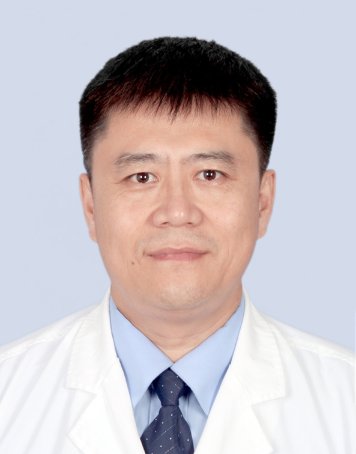

# 辛俭

## 基础信息

| 字段 | 内容 |
|---|---|
| 姓名 | 辛俭 |
| 医院 | 中山大学附属第五医院 |
| 科室 | 创面修复与烧伤外科 |
| 职称/身份 | 副主任医师 |
| 重点优先级 | 高 |
| 来源链接 | https://www.sysu5.cn/medical-service/department-expert/doctor/9092 |
| 采集日期 | 2026-08-08 |

## 简介/擅长

辛俭医生来自中山大学附属第五医院创面修复与烧伤外科，官网公开资料显示其诊疗线索与慢性病、肿瘤、免疫/风湿/感染、术后恢复/康复相关。
官网擅长线索：擅长各类难愈性创面的修复以及包括面部年轻化、形体雕塑等各类整形美容手术。

## 可包装亮点

- 副主任医师 副主任医师 广东省中西医协会烧伤专业委员会副主任委员，广东省医学会烧伤整形专业委员会委员。
- 主持1项省级科研课题研究，获市一等奖，发表论文10篇。

## 重点疾病/人群标签

- 慢性病：糖尿病
- 肿瘤：肿瘤、瘤
- 生殖疾病：
- 免疫/风湿：感染
- 术后恢复/康复：创面、烧伤
- 疑难重症：

## 证据摘录

> 以下只保留官网公开信息中的短句或关键字段，不复制大段原文。

- 官网身份字段：副主任医师
- 官网擅长线索：擅长各类难愈性创面的修复以及包括面部年轻化、形体雕塑等各类整形美容手术。
- 官网经历线索：副主任医师 副主任医师 广东省中西医协会烧伤专业委员会副主任委员，广东省医学会烧伤整形专业委员会委员。 主持1项省级科研课题研究，获市一等奖，发表论文10篇。
- 来源链接：https://www.sysu5.cn/medical-service/department-expert/doctor/9092

## BD 画像摘要

辛俭医生可作为慢性病、肿瘤、免疫/风湿/感染、术后恢复/康复方向的医生画像候选。后续 BD 包装应围绕官网已展示的科室、职称、擅长和经历线索展开，保持待人工复核状态，不添加疗效承诺。

## 合规边界

- 本条画像仅基于医院官网公开医生详情页整理。
- 未采集私人联系方式、患者案例、非公开排班或第三方评价。
- 所有亮点均需保留来源链接，不得改写为治疗效果承诺。
