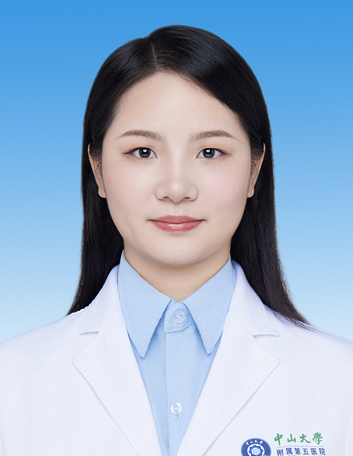

# 金亚南

## 基础信息

| 字段 | 内容 |
|---|---|
| 姓名 | 金亚南 |
| 医院 | 中山大学附属第五医院 |
| 科室 | 放射肿瘤科 |
| 职称/身份 | 副主任医师，医学博士，博士后。 |
| 重点优先级 | 高 |
| 来源链接 | https://www.sysu5.cn/medical-service/department-expert/doctor/13042 |
| 采集日期 | 2026-08-08 |

## 简介/擅长

金亚南医生来自中山大学附属第五医院放射肿瘤科，官网公开资料显示其诊疗线索与肿瘤相关。
官网擅长线索：擅长：乳腺癌、鼻咽癌的放化疗及综合治疗。 硕士、博士均毕业于中山大学肿瘤防治中心，博士后出站留院工作至今，入选中山五院优秀青年人才支持计划，擅长乳腺癌、鼻咽癌的临床诊治。

## 可包装亮点

- 副主任医师，医学博士，博士后。
- 硕士、博士均毕业于中山大学肿瘤防治中心，博士后出站留院工作至今，入选中山五院优秀青年人才支持计划，擅长乳腺癌、鼻咽癌的临床诊治。
- 担任广州抗癌协会第四届放射肿瘤学专业委员会青年委员、珠海市抗癌协会第三届乳腺癌专业委员会委员、珠海市抗癌协会第三届鼻咽癌专业委员会委员、珠海市抗癌协会第三届肿瘤化疗专业委员会委员。

## 重点疾病/人群标签

- 慢性病：
- 肿瘤：肿瘤、癌、瘤、化疗、鼻咽癌、乳腺癌
- 生殖疾病：
- 免疫/风湿：
- 术后恢复/康复：
- 疑难重症：

## 证据摘录

> 以下只保留官网公开信息中的短句或关键字段，不复制大段原文。

- 官网身份字段：副主任医师，医学博士，博士后。
- 官网擅长线索：擅长：乳腺癌、鼻咽癌的放化疗及综合治疗。 硕士、博士均毕业于中山大学肿瘤防治中心，博士后出站留院工作至今，入选中山五院优秀青年人才支持计划，擅长乳腺癌、鼻咽癌的临床诊治。
- 官网经历线索：副主任医师，医学博士，博士后。 硕士、博士均毕业于中山大学肿瘤防治中心，博士后出站留院工作至今，入选中山五院优秀青年人才支持计划，擅长乳腺癌、鼻咽癌的临床诊治。 担任广州抗癌协会第四届放射肿瘤学专业委员会青年委员、珠海市抗癌协会第三届乳腺癌专业委员会委员、珠海市抗癌协会第三届鼻咽癌专业委员会委员、珠海市抗癌协会第三届…
- 来源链接：https://www.sysu5.cn/medical-service/department-expert/doctor/13042

## BD 画像摘要

金亚南医生可作为肿瘤方向的医生画像候选。后续 BD 包装应围绕官网已展示的科室、职称、擅长和经历线索展开，保持待人工复核状态，不添加疗效承诺。

## 合规边界

- 本条画像仅基于医院官网公开医生详情页整理。
- 未采集私人联系方式、患者案例、非公开排班或第三方评价。
- 所有亮点均需保留来源链接，不得改写为治疗效果承诺。
