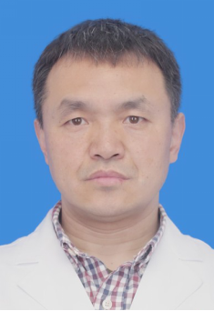

# 金红军

## 基础信息

| 字段 | 内容 |
|---|---|
| 姓名 | 金红军 |
| 医院 | 中山大学附属第五医院 |
| 科室 | 分子影像中心 |
| 职称/身份 | 研究员 博士生导师 |
| 重点优先级 | 高 |
| 来源链接 | https://www.sysu5.cn/medical-service/department-expert/doctor/10870 |
| 采集日期 | 2026-08-08 |

## 简介/擅长

金红军医生来自中山大学附属第五医院分子影像中心，官网公开资料显示其诊疗线索与肿瘤相关。
官网擅长线索：尤其擅长PET示踪药物的设计、合成及PET药物的动物学试验和临床评价。

## 可包装亮点

- 研究员 博士生导师 研究员 博士生导师 兰州大学放射化学学士 (1994)， 北京中医药大学中医临床学士（1997）,美国Texas A&M大学生物化学博士 (2007)，美国西北太平洋国家实验室（PNNL） 及华盛顿大学（St. Lou…

## 重点疾病/人群标签

- 慢性病：
- 肿瘤：肿瘤、瘤
- 生殖疾病：
- 免疫/风湿：
- 术后恢复/康复：
- 疑难重症：

## 证据摘录

> 以下只保留官网公开信息中的短句或关键字段，不复制大段原文。

- 官网身份字段：研究员 博士生导师
- 官网擅长线索：尤其擅长PET示踪药物的设计、合成及PET药物的动物学试验和临床评价。
- 官网经历线索：研究员 博士生导师 研究员 博士生导师 兰州大学放射化学学士 (1994)， 北京中医药大学中医临床学士（1997）,美国Texas A&M大学生物化学博士 (2007)，美国西北太平洋国家实验室（PNNL） 及华盛顿大学（St. Louis) 医学院博士后，正电子放射药物和P… 在肿瘤生物和神经生物标志物及分子影像…
- 来源链接：https://www.sysu5.cn/medical-service/department-expert/doctor/10870

## BD 画像摘要

金红军医生可作为肿瘤方向的医生画像候选。后续 BD 包装应围绕官网已展示的科室、职称、擅长和经历线索展开，保持待人工复核状态，不添加疗效承诺。

## 合规边界

- 本条画像仅基于医院官网公开医生详情页整理。
- 未采集私人联系方式、患者案例、非公开排班或第三方评价。
- 所有亮点均需保留来源链接，不得改写为治疗效果承诺。
