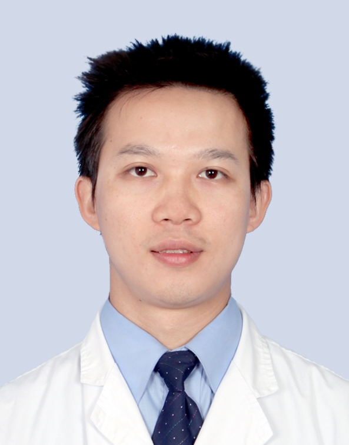

# 陈上求

## 基础信息

| 字段 | 内容 |
|---|---|
| 姓名 | 陈上求 |
| 医院 | 中山大学附属第五医院 |
| 科室 | 妇科 |
| 职称/身份 | 主治医师，医学硕士。 |
| 重点优先级 | 高 |
| 来源链接 | https://www.sysu5.cn/medical-service/department-expert/doctor/9107 |
| 采集日期 | 2026-08-08 |

## 简介/擅长

陈上求医生来自中山大学附属第五医院妇科，官网公开资料显示其诊疗线索与肿瘤、生殖疾病相关。
官网擅长线索：本科毕业于中山大学中山医学院临床医学，研究生毕业于中山大学附属第一医院妇产科，从事妇产科工作11年，擅长妇科微创手术，如宫腔镜、腹腔镜及单孔腹腔镜的手术操作，对盆腔、宫腔器质性良性病变（如子宫肌瘤、卵巢囊肿、子宫内膜异位症、子宫内膜息肉、宫腔粘连等疾病）及妇科内分泌与生殖外科有丰富的临床经验。

## 可包装亮点

- 现任珠海市妇科医师协会妇科分会内分泌学组副组长、“广东省基层医药学会生殖妇科专业委员会”第一届委员。

## 重点疾病/人群标签

- 慢性病：
- 肿瘤：瘤
- 生殖疾病：生殖、卵巢、妇科内分泌
- 免疫/风湿：
- 术后恢复/康复：
- 疑难重症：

## 证据摘录

> 以下只保留官网公开信息中的短句或关键字段，不复制大段原文。

- 官网身份字段：主治医师，医学硕士。
- 官网擅长线索：本科毕业于中山大学中山医学院临床医学，研究生毕业于中山大学附属第一医院妇产科，从事妇产科工作11年，擅长妇科微创手术，如宫腔镜、腹腔镜及单孔腹腔镜的手术操作，对盆腔、宫腔器质性良性病变（如子宫肌瘤、卵巢囊肿、子宫内膜异位症、子宫内膜息肉、宫腔粘连等疾病）及妇科内分泌与生殖外科有丰富的临床经验。
- 官网经历线索：现任珠海市妇科医师协会妇科分会内分泌学组副组长、“广东省基层医药学会生殖妇科专业委员会”第一届委员。
- 来源链接：https://www.sysu5.cn/medical-service/department-expert/doctor/9107

## BD 画像摘要

陈上求医生可作为肿瘤、生殖疾病方向的医生画像候选。后续 BD 包装应围绕官网已展示的科室、职称、擅长和经历线索展开，保持待人工复核状态，不添加疗效承诺。

## 合规边界

- 本条画像仅基于医院官网公开医生详情页整理。
- 未采集私人联系方式、患者案例、非公开排班或第三方评价。
- 所有亮点均需保留来源链接，不得改写为治疗效果承诺。
