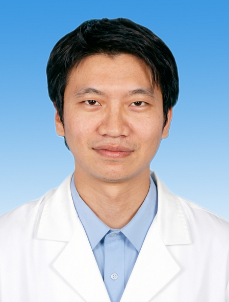

# 陈勇

## 基础信息

| 字段 | 内容 |
|---|---|
| 姓名 | 陈勇 |
| 医院 | 中山大学附属第五医院 |
| 科室 | 妇科 |
| 职称/身份 | 副主任医师，医学硕士。 |
| 重点优先级 | 高 |
| 来源链接 | https://www.sysu5.cn/medical-service/department-expert/doctor/9106 |
| 采集日期 | 2026-08-08 |

## 简介/擅长

陈勇医生来自中山大学附属第五医院妇科，官网公开资料显示其诊疗线索与肿瘤、生殖疾病、疑难重症相关。
官网擅长线索：擅长：子宫内膜病变等常见病及妇科肿瘤的诊治及宫腹腔镜手术。 2022年于中山大学附属第一医院进行妇科内窥镜相关专业进修，获得妇科四级腔镜手术资质。 从事妇科专业工作10余年，擅长妇科常见病多发病等疾病的诊治，尤其对子宫内膜病变、异常子宫出血、子宫内膜异位症、妇科肿瘤、不孕症等诊治具有丰富的临床经验，擅长各类复杂的宫、腹腔镜微创手术操作，如腹腔镜下巨大子宫肌瘤剔除术、子宫切除术、盆腔淋巴结清扫术、子宫广泛切除术及单孔腹腔镜手术等高难度腹腔镜手术以及各类宫腔镜下电切…

## 可包装亮点

- 副主任医师，医学硕士。
- 2022年于中山大学附属第一医院进行妇科内窥镜相关专业进修，获得妇科四级腔镜手术资质。
- 现任珠海市医学会妇产科学分会委员。

## 重点疾病/人群标签

- 慢性病：
- 肿瘤：肿瘤、癌、瘤
- 生殖疾病：不孕
- 免疫/风湿：
- 术后恢复/康复：
- 疑难重症：复杂

## 证据摘录

> 以下只保留官网公开信息中的短句或关键字段，不复制大段原文。

- 官网身份字段：副主任医师，医学硕士。
- 官网擅长线索：擅长：子宫内膜病变等常见病及妇科肿瘤的诊治及宫腹腔镜手术。 2022年于中山大学附属第一医院进行妇科内窥镜相关专业进修，获得妇科四级腔镜手术资质。 从事妇科专业工作10余年，擅长妇科常见病多发病等疾病的诊治，尤其对子宫内膜病变、异常子宫出血、子宫内膜异位症、妇科肿瘤、不孕症等诊治具有丰富的临床经验，擅长各类复杂的宫…
- 官网经历线索：副主任医师，医学硕士。 2022年于中山大学附属第一医院进行妇科内窥镜相关专业进修，获得妇科四级腔镜手术资质。 现任珠海市医学会妇产科学分会委员。
- 来源链接：https://www.sysu5.cn/medical-service/department-expert/doctor/9106

## BD 画像摘要

陈勇医生可作为肿瘤、生殖疾病、疑难重症方向的医生画像候选。后续 BD 包装应围绕官网已展示的科室、职称、擅长和经历线索展开，保持待人工复核状态，不添加疗效承诺。

## 合规边界

- 本条画像仅基于医院官网公开医生详情页整理。
- 未采集私人联系方式、患者案例、非公开排班或第三方评价。
- 所有亮点均需保留来源链接，不得改写为治疗效果承诺。
