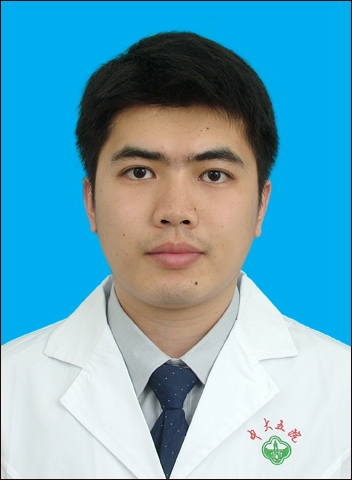

# 陈守登

## 基础信息

| 字段 | 内容 |
|---|---|
| 姓名 | 陈守登 |
| 医院 | 中山大学附属第五医院 |
| 科室 | 分子影像中心 |
| 职称/身份 | 实验医学部主任 研究员 博士生导师 |
| 重点优先级 | 高 |
| 来源链接 | https://www.sysu5.cn/medical-service/department-expert/doctor/10856 |
| 采集日期 | 2026-08-08 |

## 简介/擅长

陈守登医生来自中山大学附属第五医院分子影像中心，官网公开资料中可提取到肿瘤方向线索。

## 可包装亮点

- 实验医学部主任 研究员 博士生导师 实验医学部主任 研究员 博士生导师 2012年获得中国科学院生物物理研究所生物化学与分子生物学博士学位，2012年2月至2016年9月在美国纽约纪念斯隆凯特琳癌症研究中心（Memorial Sloan…

## 重点疾病/人群标签

- 慢性病：
- 肿瘤：癌
- 生殖疾病：
- 免疫/风湿：
- 术后恢复/康复：
- 疑难重症：

## 证据摘录

> 以下只保留官网公开信息中的短句或关键字段，不复制大段原文。

- 官网身份字段：实验医学部主任 研究员 博士生导师
- 官网经历线索：实验医学部主任 研究员 博士生导师 实验医学部主任 研究员 博士生导师 2012年获得中国科学院生物物理研究所生物化学与分子生物学博士学位，2012年2月至2016年9月在美国纽约纪念斯隆凯特琳癌症研究中心（Memorial Sloan Kettering Cancer Cen… 主持国家自然科学基金面上项目1项，广…
- 来源链接：https://www.sysu5.cn/medical-service/department-expert/doctor/10856

## BD 画像摘要

陈守登医生可作为肿瘤方向的医生画像候选。后续 BD 包装应围绕官网已展示的科室、职称、擅长和经历线索展开，保持待人工复核状态，不添加疗效承诺。

## 合规边界

- 本条画像仅基于医院官网公开医生详情页整理。
- 未采集私人联系方式、患者案例、非公开排班或第三方评价。
- 所有亮点均需保留来源链接，不得改写为治疗效果承诺。
