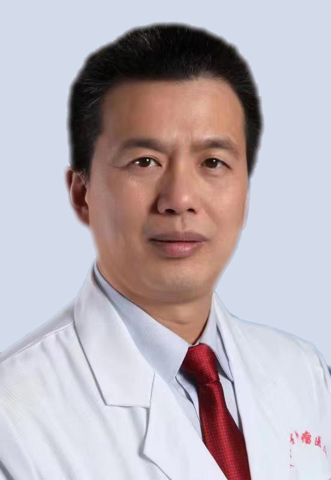

# 陈敏山

## 基础信息

| 字段 | 内容 |
|---|---|
| 姓名 | 陈敏山 |
| 医院 | 中山大学附属第五医院 |
| 科室 | 肝胆外科 |
| 职称/身份 | 肝胆外科主任，肝移植专科主任，教授，主任医任，医学博士，博士生导师。 |
| 重点优先级 | 高 |
| 来源链接 | https://www.sysu5.cn/medical-service/department-expert/doctor/3124 |
| 采集日期 | 2026-08-08 |

## 简介/擅长

陈敏山医生来自中山大学附属第五医院肝胆外科，官网公开资料显示其诊疗线索与肿瘤、免疫/风湿/感染、疑难重症相关。
官网擅长线索：从事肝癌的临床和研究工作30多年，熟悉和掌握肝癌其他多种治疗手段，并积极推广肝癌的多学科综合治疗。 在肝癌切除术、血管介入治疗和射频治疗有着数千例以上的临床经验，是国内外少有的能够同时熟练开展肝癌（切除、介入、消融）三大治疗手段的专家，并熟悉肝癌的移植、放疗、化疗、生物免疫治疗、靶向药物治疗等多种方法。 可独立完成难度较大的手术，如巨大肝癌切除术、肝中央型肝癌切除术、肝尾状叶肝癌切除术、腹腔镜肝切除术、机器人辅助肝癌切除术等。 学术主攻和重点研究方向是小肝癌射频消融治疗和肝癌多学科综合治疗。

## 可包装亮点

- 肝胆外科主任，肝移植专科主任，教授，主任医任，医学博士，博士生导师。
- 从事肝癌的临床和研究工作30多年，熟悉和掌握肝癌其他多种治疗手段，并积极推广肝癌的多学科综合治疗。
- 学术主攻和重点研究方向是小肝癌射频消融治疗和肝癌多学科综合治疗。

## 重点疾病/人群标签

- 慢性病：
- 肿瘤：癌、放疗、化疗、靶向、肝癌
- 生殖疾病：
- 免疫/风湿：免疫
- 术后恢复/康复：
- 疑难重症：多学科

## 证据摘录

> 以下只保留官网公开信息中的短句或关键字段，不复制大段原文。

- 官网身份字段：肝胆外科主任，肝移植专科主任，教授，主任医任，医学博士，博士生导师。
- 官网擅长线索：从事肝癌的临床和研究工作30多年，熟悉和掌握肝癌其他多种治疗手段，并积极推广肝癌的多学科综合治疗。 在肝癌切除术、血管介入治疗和射频治疗有着数千例以上的临床经验，是国内外少有的能够同时熟练开展肝癌（切除、介入、消融）三大治疗手段的专家，并熟悉肝癌的移植、放疗、化疗、生物免疫治疗、靶向药物治疗等多种方法。 可独立完成难…
- 官网经历线索：肝胆外科主任，肝移植专科主任，教授，主任医任，医学博士，博士生导师。 从事肝癌的临床和研究工作30多年，熟悉和掌握肝癌其他多种治疗手段，并积极推广肝癌的多学科综合治疗。 学术主攻和重点研究方向是小肝癌射频消融治疗和肝癌多学科综合治疗。
- 来源链接：https://www.sysu5.cn/medical-service/department-expert/doctor/3124

## BD 画像摘要

陈敏山医生可作为肿瘤、免疫/风湿/感染、疑难重症方向的医生画像候选。后续 BD 包装应围绕官网已展示的科室、职称、擅长和经历线索展开，保持待人工复核状态，不添加疗效承诺。

## 合规边界

- 本条画像仅基于医院官网公开医生详情页整理。
- 未采集私人联系方式、患者案例、非公开排班或第三方评价。
- 所有亮点均需保留来源链接，不得改写为治疗效果承诺。
