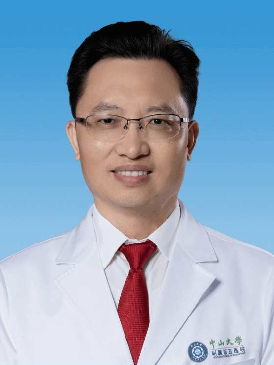

# 陈明远

## 基础信息

| 字段 | 内容 |
|---|---|
| 姓名 | 陈明远 |
| 医院 | 中山大学附属第五医院 |
| 科室 | 鼻咽癌防治中心 |
| 职称/身份 | 中山大学附属第五医院副院长，二级教授，主任医师，医学博士，博士生导师。 |
| 重点优先级 | 高 |
| 来源链接 | https://www.sysu5.cn/medical-service/department-expert/doctor/835 |
| 采集日期 | 2026-08-08 |

## 简介/擅长

陈明远医生来自中山大学附属第五医院鼻咽癌防治中心，官网公开资料显示其诊疗线索与肿瘤、免疫/风湿/感染相关。
官网擅长线索：擅长：鼻咽癌，擅长鼻咽癌放疗、化疗及外科等综合治疗。 主要学术贡献：1、复发鼻咽癌微创外科技术体系：针对可手术复发鼻咽癌，首创微创外科技术体系，完全避免了二次放疗的毒副反应，确立了“外科优先”的新治疗规范（Lancet Oncol, 2021; 2、复发鼻咽癌超分割放疗新技术：针对不可手术但可放疗的复发鼻咽癌，革新超分割放疗技术，显著降低二次放疗的毒副反应（Lancet, 2023）。

## 可包装亮点

- 中山大学附属第五医院副院长，二级教授，主任医师，医学博士，博士生导师。
- 国家高层次人才“万人计划”科技创新领军人才，科技部中青年科技创新领军人才，教育部新世纪优秀人才，广东省杰出青年医学人才。
- 兼任中国抗癌协会鼻咽癌整合防筛专业委员会主任委员，中国医疗保健国际交流促进会鼻咽癌防治分会副主委兼秘书长，中国健康促进基金会头颈肿瘤专业委员会副主委，广东省抗癌协会鼻咽癌专业委员会主任委员等。

## 重点疾病/人群标签

- 慢性病：
- 肿瘤：肿瘤、癌、瘤、放疗、化疗、鼻咽癌
- 生殖疾病：
- 免疫/风湿：免疫
- 术后恢复/康复：
- 疑难重症：

## 证据摘录

> 以下只保留官网公开信息中的短句或关键字段，不复制大段原文。

- 官网身份字段：中山大学附属第五医院副院长，二级教授，主任医师，医学博士，博士生导师。
- 官网擅长线索：擅长：鼻咽癌，擅长鼻咽癌放疗、化疗及外科等综合治疗。 主要学术贡献：1、复发鼻咽癌微创外科技术体系：针对可手术复发鼻咽癌，首创微创外科技术体系，完全避免了二次放疗的毒副反应，确立了“外科优先”的新治疗规范（Lancet Oncol, 2021; 2、复发鼻咽癌超分割放疗新技术：针对不可手术但可放疗的复发鼻咽癌，革新超…
- 官网经历线索：中山大学附属第五医院副院长，二级教授，主任医师，医学博士，博士生导师。 国家高层次人才“万人计划”科技创新领军人才，科技部中青年科技创新领军人才，教育部新世纪优秀人才，广东省杰出青年医学人才。 兼任中国抗癌协会鼻咽癌整合防筛专业委员会主任委员，中国医疗保健国际交流促进会鼻咽癌防治分会副主委兼秘书长，中国健康促进基金会…
- 来源链接：https://www.sysu5.cn/medical-service/department-expert/doctor/835

## BD 画像摘要

陈明远医生可作为肿瘤、免疫/风湿/感染方向的医生画像候选。后续 BD 包装应围绕官网已展示的科室、职称、擅长和经历线索展开，保持待人工复核状态，不添加疗效承诺。

## 合规边界

- 本条画像仅基于医院官网公开医生详情页整理。
- 未采集私人联系方式、患者案例、非公开排班或第三方评价。
- 所有亮点均需保留来源链接，不得改写为治疗效果承诺。
