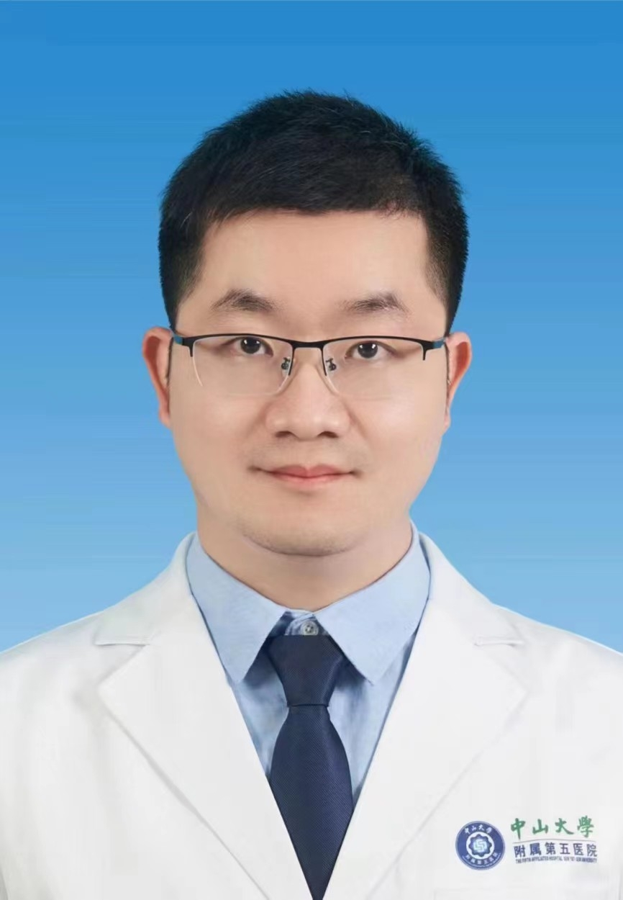

# 陈晓波

## 基础信息

| 字段 | 内容 |
|---|---|
| 姓名 | 陈晓波 |
| 医院 | 中山大学附属第五医院 |
| 科室 | 超声医学科 |
| 职称/身份 | 副主任医师，医学硕士。 |
| 重点优先级 | 高 |
| 来源链接 | https://www.sysu5.cn/medical-service/department-expert/doctor/10853 |
| 采集日期 | 2026-08-08 |

## 简介/擅长

陈晓波医生来自中山大学附属第五医院超声医学科。
官网擅长线索：从事超声诊疗工作10余年，具有丰富的临床经验，尤其擅长各种心血管疾病的超声诊断，同时负责各种心脏手术的围手术期超声评估，如各种先心病封堵术、心脏瓣膜成形/置换术、经导管主动脉瓣置换术（TAVR）、二尖瓣夹合术（MitraCLip）及左心辅助装置植入术等。

## 可包装亮点

- 副主任医师，医学硕士。
- 现任珠海市医学会超声医学分会委员、珠海市医师协会超声医师分会委员、珠海市中西医结合学会第二届心血管专业委员会委员等。
- 主持及参与各类科研基金多项，在国内外期刊发表文章10余篇。

## 重点疾病/人群标签

- 慢性病：
- 肿瘤：
- 生殖疾病：
- 免疫/风湿：
- 术后恢复/康复：
- 疑难重症：

## 证据摘录

> 以下只保留官网公开信息中的短句或关键字段，不复制大段原文。

- 官网身份字段：副主任医师，医学硕士。
- 官网擅长线索：从事超声诊疗工作10余年，具有丰富的临床经验，尤其擅长各种心血管疾病的超声诊断，同时负责各种心脏手术的围手术期超声评估，如各种先心病封堵术、心脏瓣膜成形/置换术、经导管主动脉瓣置换术（TAVR）、二尖瓣夹合术（MitraCLip）及左心辅助装置植入术等。
- 官网经历线索：副主任医师，医学硕士。 现任珠海市医学会超声医学分会委员、珠海市医师协会超声医师分会委员、珠海市中西医结合学会第二届心血管专业委员会委员等。 主持及参与各类科研基金多项，在国内外期刊发表文章10余篇。
- 来源链接：https://www.sysu5.cn/medical-service/department-expert/doctor/10853

## BD 画像摘要

陈晓波医生可作为超声医学科基础医生数据入库。当前官网资料暂未显示与本阶段重点疾病方向的强关联，建议先保留基础画像，后续按官方资料补充复核。

## 合规边界

- 本条画像仅基于医院官网公开医生详情页整理。
- 未采集私人联系方式、患者案例、非公开排班或第三方评价。
- 所有亮点均需保留来源链接，不得改写为治疗效果承诺。
