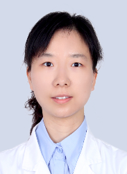

# 陈楠

## 基础信息

| 字段 | 内容 |
|---|---|
| 姓名 | 陈楠 |
| 医院 | 中山大学附属第五医院 |
| 科室 | 胸部肿瘤内科 |
| 职称/身份 | 副主任医师，医学博士，硕士生导师。 |
| 重点优先级 | 高 |
| 来源链接 | https://www.sysu5.cn/medical-service/department-expert/doctor/13917 |
| 采集日期 | 2026-08-08 |

## 简介/擅长

陈楠医生来自中山大学附属第五医院胸部肿瘤内科，官网公开资料显示其诊疗线索与肿瘤、免疫/风湿/感染、疑难重症相关。
官网擅长线索：擅长：擅长各种类型的淋巴瘤，及CART治疗。 擅长体表肿物、肺癌、食管癌的诊治。

## 可包装亮点

- 副主任医师，医学博士，硕士生导师。
- 曾到中山大学附属肿瘤医院进修淋巴瘤和CART治疗。
- 现任广东省保健协会血液肿瘤分会副主任委员，广东省抗癌协会淋巴瘤专委会委员，广东省临床医学会肿瘤免疫治疗专委会常委，广东省中西医结合学会肿瘤专委会委员，中国抗癌协会肿瘤药物临床研究专委会委员。

## 重点疾病/人群标签

- 慢性病：
- 肿瘤：肿瘤、癌、瘤、淋巴瘤、化疗、肺癌
- 生殖疾病：
- 免疫/风湿：免疫
- 术后恢复/康复：
- 疑难重症：难治

## 证据摘录

> 以下只保留官网公开信息中的短句或关键字段，不复制大段原文。

- 官网身份字段：副主任医师，医学博士，硕士生导师。
- 官网擅长线索：擅长：擅长各种类型的淋巴瘤，及CART治疗。 擅长体表肿物、肺癌、食管癌的诊治。
- 官网经历线索：副主任医师，医学博士，硕士生导师。 曾到中山大学附属肿瘤医院进修淋巴瘤和CART治疗。 现任广东省保健协会血液肿瘤分会副主任委员，广东省抗癌协会淋巴瘤专委会委员，广东省临床医学会肿瘤免疫治疗专委会常委，广东省中西医结合学会肿瘤专委会委员，中国抗癌协会肿瘤药物临床研究专委会委员。
- 来源链接：https://www.sysu5.cn/medical-service/department-expert/doctor/13917

## BD 画像摘要

陈楠医生可作为肿瘤、免疫/风湿/感染、疑难重症方向的医生画像候选。后续 BD 包装应围绕官网已展示的科室、职称、擅长和经历线索展开，保持待人工复核状态，不添加疗效承诺。

## 合规边界

- 本条画像仅基于医院官网公开医生详情页整理。
- 未采集私人联系方式、患者案例、非公开排班或第三方评价。
- 所有亮点均需保留来源链接，不得改写为治疗效果承诺。
