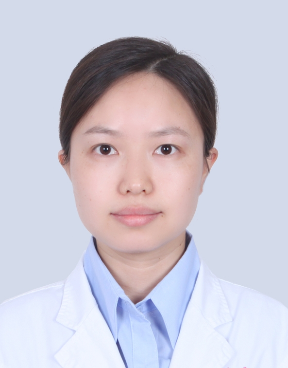

# 陈美竹

## 基础信息

| 字段 | 内容 |
|---|---|
| 姓名 | 陈美竹 |
| 医院 | 中山大学附属第五医院 |
| 科室 | 呼吸与危重症学科 |
| 职称/身份 | 副主任医师，医学硕士。 |
| 重点优先级 | 高 |
| 来源链接 | https://www.sysu5.cn/medical-service/department-expert/doctor/845 |
| 采集日期 | 2026-08-08 |

## 简介/擅长

陈美竹医生来自中山大学附属第五医院呼吸与危重症学科，官网公开资料显示其诊疗线索与慢性病、免疫/风湿/感染、术后恢复/康复、疑难重症相关。
官网擅长线索：在诊治慢性阻塞性肺疾病、支气管扩张、肺部感染、支气管哮喘等呼吸系统常见病、多发病及呼吸衰竭、肺栓塞等急危重症方面具有丰富的临床经验，机械通气、气管镜操作娴熟，擅长于心肺运动试验的实施、解读及呼吸系统慢性疾病呼吸功能康复治疗。

## 可包装亮点

- 呼吸与危重症学科 呼吸与危重症学科 副主任医师，医学硕士。
- 副主任医师，医学硕士。

## 重点疾病/人群标签

- 慢性病：慢性
- 肿瘤：
- 生殖疾病：
- 免疫/风湿：感染
- 术后恢复/康复：康复
- 疑难重症：危重、重症、急危重

## 证据摘录

> 以下只保留官网公开信息中的短句或关键字段，不复制大段原文。

- 官网身份字段：副主任医师，医学硕士。
- 官网擅长线索：在诊治慢性阻塞性肺疾病、支气管扩张、肺部感染、支气管哮喘等呼吸系统常见病、多发病及呼吸衰竭、肺栓塞等急危重症方面具有丰富的临床经验，机械通气、气管镜操作娴熟，擅长于心肺运动试验的实施、解读及呼吸系统慢性疾病呼吸功能康复治疗。
- 官网经历线索：呼吸与危重症学科 呼吸与危重症学科 副主任医师，医学硕士。 副主任医师，医学硕士。
- 来源链接：https://www.sysu5.cn/medical-service/department-expert/doctor/845

## BD 画像摘要

陈美竹医生可作为慢性病、免疫/风湿/感染、术后恢复/康复、疑难重症方向的医生画像候选。后续 BD 包装应围绕官网已展示的科室、职称、擅长和经历线索展开，保持待人工复核状态，不添加疗效承诺。

## 合规边界

- 本条画像仅基于医院官网公开医生详情页整理。
- 未采集私人联系方式、患者案例、非公开排班或第三方评价。
- 所有亮点均需保留来源链接，不得改写为治疗效果承诺。
