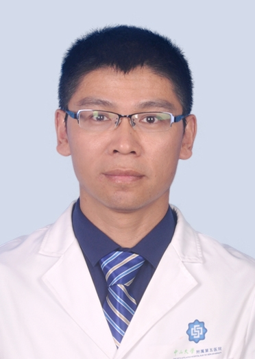

# 韩岩智

## 基础信息

| 字段 | 内容 |
|---|---|
| 姓名 | 韩岩智 |
| 医院 | 中山大学附属第五医院 |
| 科室 | 消化内科 |
| 职称/身份 | 副主任医师，医生硕士，硕士生导师。 |
| 重点优先级 | 高 |
| 来源链接 | https://www.sysu5.cn/medical-service/department-expert/doctor/854 |
| 采集日期 | 2026-08-08 |

## 简介/擅长

韩岩智医生来自中山大学附属第五医院消化内科，官网公开资料显示其诊疗线索与肿瘤相关。
官网擅长线索：2012年取得了医学硕士学位，从事消化及消化内镜工作15年余，对消化系统疾病诊治积累了丰富经验，能熟练操作胃肠镜检查及内镜下治疗，擅长消化道疾病、胆道及胰腺疾病的内镜下诊疗。 包括内镜下逆行胰胆管造影术（ERCP）； 内镜下胆道子母镜（SpyGlass），内镜下息肉治疗、消化道肿瘤梗阻内镜下支架置入、消化道出血的内镜下治疗（套扎、硬化，组织胶注射）、内镜下胃造瘘等； 对消化道早期恶性肿瘤诊治、超声内镜诊疗也有较好认识。

## 可包装亮点

- 副主任医师，医生硕士，硕士生导师。
- 多次前往西京医院、北京友谊医院、上海瑞金医院、杭州市第一人民医院进修学习；
- 现任中国医师协会内镜医师分会消化内镜青年委员会常委，中国中西医结合学会消化内镜学专业委员会内镜质控专家委员会委员，中国医师协会消化内镜培训导师；

## 重点疾病/人群标签

- 慢性病：
- 肿瘤：肿瘤、瘤
- 生殖疾病：
- 免疫/风湿：
- 术后恢复/康复：
- 疑难重症：

## 证据摘录

> 以下只保留官网公开信息中的短句或关键字段，不复制大段原文。

- 官网身份字段：副主任医师，医生硕士，硕士生导师。
- 官网擅长线索：2012年取得了医学硕士学位，从事消化及消化内镜工作15年余，对消化系统疾病诊治积累了丰富经验，能熟练操作胃肠镜检查及内镜下治疗，擅长消化道疾病、胆道及胰腺疾病的内镜下诊疗。 包括内镜下逆行胰胆管造影术（ERCP）； 内镜下胆道子母镜（SpyGlass），内镜下息肉治疗、消化道肿瘤梗阻内镜下支架置入、消化道出血的内镜…
- 官网经历线索：副主任医师，医生硕士，硕士生导师。 多次前往西京医院、北京友谊医院、上海瑞金医院、杭州市第一人民医院进修学习； 现任中国医师协会内镜医师分会消化内镜青年委员会常委，中国中西医结合学会消化内镜学专业委员会内镜质控专家委员会委员，中国医师协会消化内镜培训导师；
- 来源链接：https://www.sysu5.cn/medical-service/department-expert/doctor/854

## BD 画像摘要

韩岩智医生可作为肿瘤方向的医生画像候选。后续 BD 包装应围绕官网已展示的科室、职称、擅长和经历线索展开，保持待人工复核状态，不添加疗效承诺。

## 合规边界

- 本条画像仅基于医院官网公开医生详情页整理。
- 未采集私人联系方式、患者案例、非公开排班或第三方评价。
- 所有亮点均需保留来源链接，不得改写为治疗效果承诺。
