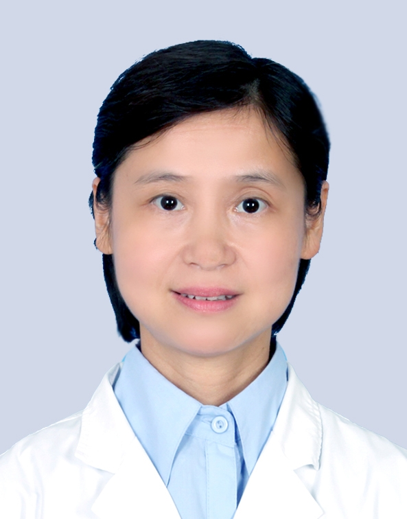

# 顾敏

## 基础信息

| 字段 | 内容 |
|---|---|
| 姓名 | 顾敏 |
| 医院 | 中山大学附属第五医院 |
| 科室 | 眼科 |
| 职称/身份 | 副主任医师。 |
| 重点优先级 | 中 |
| 来源链接 | https://www.sysu5.cn/medical-service/department-expert/doctor/10724 |
| 采集日期 | 2026-08-08 |

## 简介/擅长

## 可包装亮点

- 副主任医师。
- 1994年作为重点科技人才调入珠海。
- 于1998年在中山大学眼科中心进修青光眼、白内障、眼外伤专科一年。

## 重点疾病/人群标签

- 慢性病：
- 肿瘤：
- 生殖疾病：
- 免疫/风湿：
- 术后恢复/康复：
- 疑难重症：

## 证据摘录

> 以下只保留官网公开信息中的短句或关键字段，不复制大段原文。

- 官网身份字段：副主任医师。
- 官网经历线索：副主任医师。 1994年作为重点科技人才调入珠海。 于1998年在中山大学眼科中心进修青光眼、白内障、眼外伤专科一年。
- 来源链接：https://www.sysu5.cn/medical-service/department-expert/doctor/10724

## BD 画像摘要

顾敏医生可作为眼科基础医生数据入库。当前官网资料暂未显示与本阶段重点疾病方向的强关联，建议先保留基础画像，后续按官方资料补充复核。

## 合规边界

- 本条画像仅基于医院官网公开医生详情页整理。
- 未采集私人联系方式、患者案例、非公开排班或第三方评价。
- 所有亮点均需保留来源链接，不得改写为治疗效果承诺。
