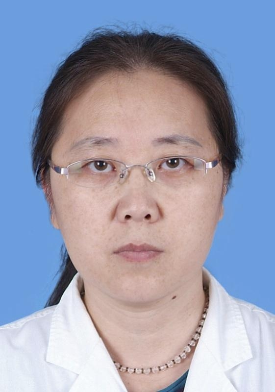

# 马琳

## 基础信息

| 字段 | 内容 |
|---|---|
| 姓名 | 马琳 |
| 医院 | 中山大学附属第五医院 |
| 科室 | 腹盆部肿瘤内科 |
| 职称/身份 | 副主任医师，硕士研究生，硕士生导师。 |
| 重点优先级 | 高 |
| 来源链接 | https://www.sysu5.cn/medical-service/department-expert/doctor/10302 |
| 采集日期 | 2026-08-08 |

## 简介/擅长

马琳医生来自中山大学附属第五医院腹盆部肿瘤内科，官网公开资料显示其诊疗线索与肿瘤、生殖疾病、术后恢复/康复相关。
官网擅长线索：至今从事肿瘤专业工作二十八年，擅长各种肿瘤的诊断及内科综合治疗，尤擅长消化系统肿瘤及妇科肿瘤的诊治、尤其对胃癌、肠癌、胰腺癌以及卵巢癌等的诊治具有丰富的临床经验。

## 可包装亮点

- 副主任医师，硕士研究生，硕士生导师。
- 广东省医学教育协会肿瘤专业委员会常务委员，广东省健康管理学会肿瘤专业委员会委员，广东省医院协会疼痛管理专业委员会委员，广东省女医师协会消化道肿瘤委员会委员，珠海市抗癌协会理事，珠海市医学会肿瘤分会委员，珠海市抗癌协会化疗专业委员，珠海市抗…
- 发表专业论文20余篇。

## 重点疾病/人群标签

- 慢性病：
- 肿瘤：肿瘤、癌、瘤、化疗、胃癌、肠癌
- 生殖疾病：卵巢
- 免疫/风湿：
- 术后恢复/康复：姑息、疼痛
- 疑难重症：

## 证据摘录

> 以下只保留官网公开信息中的短句或关键字段，不复制大段原文。

- 官网身份字段：副主任医师，硕士研究生，硕士生导师。
- 官网擅长线索：至今从事肿瘤专业工作二十八年，擅长各种肿瘤的诊断及内科综合治疗，尤擅长消化系统肿瘤及妇科肿瘤的诊治、尤其对胃癌、肠癌、胰腺癌以及卵巢癌等的诊治具有丰富的临床经验。
- 官网经历线索：副主任医师，硕士研究生，硕士生导师。 广东省医学教育协会肿瘤专业委员会常务委员，广东省健康管理学会肿瘤专业委员会委员，广东省医院协会疼痛管理专业委员会委员，广东省女医师协会消化道肿瘤委员会委员，珠海市抗癌协会理事，珠海市医学会肿瘤分会委员，珠海市抗癌协会化疗专业委员，珠海市抗癌协会癌痛与姑息专业委员会常务委员等。 发…
- 来源链接：https://www.sysu5.cn/medical-service/department-expert/doctor/10302

## BD 画像摘要

马琳医生可作为肿瘤、生殖疾病、术后恢复/康复方向的医生画像候选。后续 BD 包装应围绕官网已展示的科室、职称、擅长和经历线索展开，保持待人工复核状态，不添加疗效承诺。

## 合规边界

- 本条画像仅基于医院官网公开医生详情页整理。
- 未采集私人联系方式、患者案例、非公开排班或第三方评价。
- 所有亮点均需保留来源链接，不得改写为治疗效果承诺。
