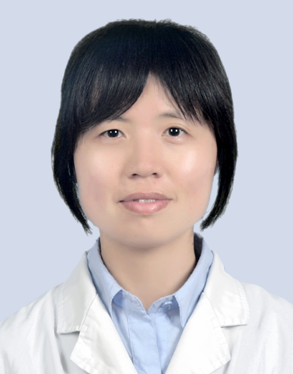

# 麦卫华

## 基础信息

| 字段 | 内容 |
|---|---|
| 姓名 | 麦卫华 |
| 医院 | 中山大学附属第五医院 |
| 科室 | 脑血管病中心 |
| 职称/身份 | 副主任医师，医学博士，硕士生导师。 |
| 重点优先级 | 高 |
| 来源链接 | https://www.sysu5.cn/medical-service/department-expert/doctor/1503 |
| 采集日期 | 2026-08-08 |

## 简介/擅长

麦卫华医生来自中山大学附属第五医院脑血管病中心，官网公开资料显示其诊疗线索与免疫/风湿/感染、术后恢复/康复相关。
官网擅长线索：从事神经科专业工作20余年，临床基础扎实，曾在神经科专业国家级医疗中心单位接受临床及科研培训多年，擅长神经科常见多发疾病的诊治，尤其对神经免疫性疾病、脑血管病、帕金森病、癫痫、中枢神经系统感染等有较丰富的临床经验，主要研究方向为神经系统脱髓鞘性、免疫性疾病及干细胞研究。

## 可包装亮点

- 副主任医师，医学博士，硕士生导师。
- 2002年中山大学七年制硕士毕业，2009年取得中山大学神经病学博士学位，2015年获国家留学基金委资助公派美国凯斯西储大学（CWRU）医学中心访学1年。
- 现为珠海市医师协会神经病学分会委员、珠海市中西医结合学会理事、广东省医学会社区康复学分会委员。

## 重点疾病/人群标签

- 慢性病：
- 肿瘤：
- 生殖疾病：
- 免疫/风湿：免疫、感染
- 术后恢复/康复：康复
- 疑难重症：

## 证据摘录

> 以下只保留官网公开信息中的短句或关键字段，不复制大段原文。

- 官网身份字段：副主任医师，医学博士，硕士生导师。
- 官网擅长线索：从事神经科专业工作20余年，临床基础扎实，曾在神经科专业国家级医疗中心单位接受临床及科研培训多年，擅长神经科常见多发疾病的诊治，尤其对神经免疫性疾病、脑血管病、帕金森病、癫痫、中枢神经系统感染等有较丰富的临床经验，主要研究方向为神经系统脱髓鞘性、免疫性疾病及干细胞研究。
- 官网经历线索：副主任医师，医学博士，硕士生导师。 2002年中山大学七年制硕士毕业，2009年取得中山大学神经病学博士学位，2015年获国家留学基金委资助公派美国凯斯西储大学（CWRU）医学中心访学1年。 现为珠海市医师协会神经病学分会委员、珠海市中西医结合学会理事、广东省医学会社区康复学分会委员。
- 来源链接：https://www.sysu5.cn/medical-service/department-expert/doctor/1503

## BD 画像摘要

麦卫华医生可作为免疫/风湿/感染、术后恢复/康复方向的医生画像候选。后续 BD 包装应围绕官网已展示的科室、职称、擅长和经历线索展开，保持待人工复核状态，不添加疗效承诺。

## 合规边界

- 本条画像仅基于医院官网公开医生详情页整理。
- 未采集私人联系方式、患者案例、非公开排班或第三方评价。
- 所有亮点均需保留来源链接，不得改写为治疗效果承诺。
